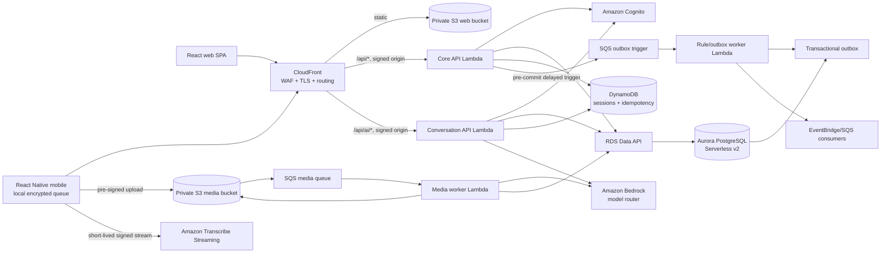

# Quartermaster end-to-end design

Status: target architecture; development data/governance foundation deployed and checked in Ohio, application integrations still pending. Q-001 through Q-009 and Q-031/Q-032 accepted; budget/domain/retention constraints extend Q-010/Q-012/Q-014. See docs/DEPLOYMENT-2026-09-07.md for exact scope and remaining gates.

Date: 2026-09-07

Audience: product, design, engineering, security, operations, and finance

Decision owner: Erick Brown

## 1. Executive summary

Quartermaster is a multi-tenant enterprise asset management system designed for churches and similarly small organizations. Its mobile experience removes data-entry friction while a person is physically inspecting equipment. Its web experience turns the resulting estate data into searchable, auditable knowledge for maintenance, insurance, disaster recovery, and accounting.

Erick Brown initially operates the service, acts as its designated data controller, and provides support. The product launches with one church tenant and supports additional tenants through the same SaaS architecture. The pilot focuses on air conditioners and appliances, with more asset classes added incrementally. Each church controls its own data through tenant administration. Privacy and compliance are first-class design requirements from the first release. Humans are responsible for physical work and safety decisions; AI may offer reminders and record observations.

The design deliberately separates judgment from transcription:

- The human observes equipment, assesses access and safety, takes photographs, and confirms facts.
- The AI interprets speech and images, proposes structured values, and drives a versioned capture checklist.
- Deterministic application code validates permissions, field types, business rules, dates, units, and state transitions.
- AI output remains a proposal with confidence and provenance until policy says it can be accepted or a human confirms it.

The proposed AWS platform is a cost-conscious serverless architecture. A React web application and two small API Lambdas sit behind CloudFront. Aurora PostgreSQL Serverless v2 is the relational system of record and reporting engine. S3 stores original and derived media. DynamoDB holds short-lived conversation and synchronization state. SQS and Lambda decouple image processing. Cognito handles identity, and Amazon Bedrock plus Amazon Transcribe provide multimodal and speech capabilities. There are no NAT gateways, load balancers, container clusters, provisioned model endpoints, caches, or search clusters at launch.

Both production and development are designed to reach zero application compute during idle periods. Aurora Serverless v2 uses `min_capacity=0` with a five-minute auto-pause, CloudFront starts on the $0 Free flat-rate plan, and every runtime/worker is request- or event-driven. The illustrative retained database/secret cost is $1.40/month for development alone; the two-environment reference is $2.80/month after assumed account allowances, before media, backup copies, shared fees, and activity. See `cost_model.md` for quantities and pricing dates; account allowances are not guaranteed. “Scale-to-zero” means zero continuously billed application compute, network, and edge capacity, not a zero AWS bill. A database wake normally takes about 15 seconds and can take 30 seconds or longer after deep sleep, so cold activation is an explicit product state with a longer SLO, progress feedback, bounded retry, and idempotent mutations.

The immediate AWS region is `us-east-2` (Ohio); `us-east-1` and `us-west-2` are approved alternatives when needed. Local development/testing uses the account reached by the `default` AWS profile. Terraform and consistent tags must support a later account move. The repository is public; CodeBuild runs shared GitHub Actions checks, CodePipeline orchestrates cloud deployments, `mac-dev` builds/signs iOS, and `linux-dev` builds/tests Android. The accepted availability target is 99.5% with a 60-second cold-start allowance. Recovery should preferably lose at most one day of server-acknowledged data; up to seven days is tolerated if a shorter recovery point would be disproportionately expensive.

## 2. Product boundaries

### 2.1 Goals

1. Make asset capture in the field faster and more complete than a form-first application.
2. Preserve source evidence: who asserted a fact, when, through which interaction, and from which image or reading.
3. Support the full asset lifecycle from discovery through maintenance, incidents, valuation, and disposal.
4. Make the entire estate understandable through exact search, faceting, reports, calculations, exports, and safe natural-language queries.
5. Serve multiple independent organizations with strong tenant isolation.
6. Continue useful field work through intermittent connectivity and synchronize safely later.
7. Scale from a pilot to many organizations without re-platforming or paying large idle infrastructure charges.
8. Give an organization a complete, portable export of its structured data and media.
9. Make privacy, tenant control, and compliance part of every feature's data lifecycle and acceptance criteria, including the single-tenant pilot.

### 2.2 Non-goals for the first release

- A general ledger, accounts-payable system, purchasing suite, or full computerized maintenance management system.
- Automated diagnosis of equipment or instructions that replace a qualified technician.
- Autonomous physical or financially material actions.
- Arbitrary AI-generated SQL, code execution, or unrestricted agents.
- Live video analysis, continuous background listening, or always-on wake words.
- Dedicated infrastructure per tenant by default.
- OpenSearch, a vector database, or a data warehouse before PostgreSQL search/reporting is proven inadequate.

### 2.3 Product principles

- Voice first, never voice only. Every action must also be visible and operable by touch or keyboard.
- Confirm uncertainty, not everything. Confidence thresholds and policy determine when to ask.
- Capture now, enrich later. Poor connectivity must not destroy field progress.
- Evidence is immutable; interpretations are versioned.
- Safety outranks checklist completion.
- Humans decide whether and how to perform physical work; AI safety reminders are advisory and do not certify a person, procedure, or work site.
- Every church controls access to and permitted use of its data; privacy and compliance are required from the first release.
- AI suggests; application policy decides; humans approve consequential changes.
- Accessibility and clear recovery paths are part of the primary workflow.
- Cost is a measurable architecture property, not a late optimization exercise.

## 3. Users, tenancy, and authorization

### 3.1 Actors

| Actor | Typical capabilities |
|---|---|
| Organization owner | Billing contact, policy, retention, integrations, all data, member administration |
| Estate administrator | Asset taxonomy, locations, rules, reporting, imports/exports, work assignment |
| Field contributor | Create and update assets, capture media/readings, complete assigned inspections |
| Maintenance technician | Field contributor permissions plus work orders and organization-managed procedures; the application role does not certify physical-work qualifications |
| Finance/insurance viewer | Read assets, values, policies, depreciation, evidence, and exports; no field mutation |
| Auditor | Time-bounded read-only access to records, evidence, and audit history |
| Quartermaster support | No standing tenant-data access; audited, tenant-approved, time-bound support elevation only |

Permissions are capabilities, not hard-coded role names. Organizations may create roles by combining capabilities. High-risk capabilities such as bulk update, disposal, export, policy change, and support access always require recent authentication and are audited.

### 3.2 Tenant model

- Multi-tenant SaaS is an accepted requirement. Production begins with one church tenant; onboarding another church creates a tenant and memberships in the existing platform, without a new application deployment or database per church.
- `tenant_id` is present on every tenant-owned relational row and every operational event.
- PostgreSQL row-level security (RLS) is enabled and forced. The application database role does not own tenant tables and cannot bypass RLS.
- Each transaction sets a validated tenant and actor context before accessing tenant tables.
- The source of tenant membership is the application database, not mutable client claims. Cognito proves identity; the API resolves current membership and capabilities.
- S3 object keys use opaque identifiers, not organization or asset names. A typical key is `tenant/{tenant_id}/media/{media_id}/original`.
- Pre-signed media operations are issued only after authorization, are content/type/size constrained, and expire quickly.
- Cross-tenant tests are mandatory for every repository/service method, using at least two synthetic tenants even while only one real church uses the service. No pilot-only authorization bypass or hard-coded tenant ID is permitted.

Dedicated databases or accounts per tenant remain a later option for contractual isolation; they are not the default economics.

### 3.3 Service ownership and church data controls

- Erick Brown is the current service owner, designated data controller, and support operator. If the venture proves viable, he intends to form an LLC and transfer the service to it; incorporation is not a prerequisite for the pilot.
- Each church administers its own memberships, permissions, asset records, exports, support-access grants, and data-lifecycle settings within the service's supported policies. Accepted retention is 15 days for originals/transcripts, one year for audits, and three months for backups. Derivative-photo, backup-purge, metadata-duration, exceptional-hold, and privacy-notice details remain part of Q-014 and related decisions.
- Erick's support role uses the same tenant-approved, time-limited, audited access mechanism as any later support staff. Administrative recovery access is separately restricted and audited. Operating the service does not grant ordinary support sessions blanket access to church records.
- Privacy documentation will describe the purposes and parties involved in each processing activity, including church-directed processing and service account/support processing. The designated service contact does not replace the need to document each church's control and the applicable controller/processor roles for that activity.
- Service-operator identity, privacy/support contacts, and notice/terms versions are configurable. A future LLC transfer updates those records, account and contract ownership, and required customer notices; it preserves tenant IDs, permissions, evidence, and the historical identity of Erick as the actor on prior audit events.

### 3.4 Pilot scope and asset-class expansion

The initial real tenant pilots air conditioners and appliances. The specific church, appliance subtypes, and asset counts will be entered during pilot setup. Erick owns the initial product scope and can delegate template authoring as the service grows.

Asset classes use a common asset record plus versioned type schemas, capture checklists, image intents, and measurement definitions. Adding a class normally means publishing and evaluating a new template/schema version, without changing the core asset table or hard-coding a separate mobile workflow. Existing records and drafts retain their schema/workflow version; upgrades are explicit. A class needing a new capability can still require code, but expanding the taxonomy alone does not. Initial templates and extraction evaluations cover air conditioners and appliances; further classes are added incrementally with appropriate field examples.

## 4. Experience design

### 4.1 Mobile application

The mobile application is a React Native application for iOS and Android. It is optimized for one-handed use, gloves, bright environments, noisy mechanical rooms, roofs, and intermittent connectivity.

Primary navigation:

- Work: assigned inspections and maintenance items.
- Capture: add, identify, move, update, retire, or assess an asset.
- Nearby/recent: resume the last asset or draft quickly.
- Search: barcode/QR scan, identifiers, names, location, and recent results.
- Sync: visible queue, retry state, conflicts, and storage usage.

Interaction requirements:

- A prominent push-to-talk control is the default. An explicit hands-free session can use voice activity detection, but never starts in the background.
- Live partial transcript remains visible and editable.
- The assistant speaks through platform-native text-to-speech initially; all prompts also appear as text.
- Speech is interruptible. Touching a control or beginning to speak stops playback.
- When camera capture is requested, the app shows the requested view (for example `nameplate`), a short example/overlay, flash control, and a touch fallback. OS camera permission and capture always remain user-controlled.
- A persistent summary chip shows what will be created: asset, media count, notes, readings, and maintenance items.
- The user can say or tap “show me what you have,” “go back,” “skip,” “save draft,” or “cancel.”
- Before commit, the app presents a concise review with uncertain values highlighted.
- If a data request must wake the database, the app keeps the local draft usable, displays “Starting Quartermaster,” and retries safely without asking the user to repeat a captured observation.
- Accessibility supports screen readers, large type, high contrast, captions, external keyboards, switch controls, and haptics independent of color.

### 4.2 Offline behavior

Asset viewing and field capture must remain useful offline:

1. The app caches assigned work, relevant locations, asset-type templates, and recently viewed assets.
2. Drafts, operations, and media are written locally before any upload is attempted.
3. Every mutation receives a client-generated UUID and idempotency key.
4. When online, operations synchronize in dependency order; media upload uses resumable multipart upload for large files.
5. AI interpretation is unavailable offline in v1. The app records audio only if the user explicitly chooses deferred transcription; otherwise it falls back to typing and structured controls.
6. Conflicting edits do not silently overwrite. Non-overlapping field changes merge; overlapping values appear in a side-by-side resolution screen with actor and timestamp.
7. Local records are removed only after the server acknowledges the operation and retention policy permits cleanup.

The local database and queued media use OS data protection. Full SQLCipher encryption and mobile-device-management requirements are an unresolved security decision.

### 4.3 Web application

The web application is a responsive React single-page application. It optimizes for comprehension rather than field entry.

Core views:

- Estate overview: asset count/value/condition, deferred maintenance, warranty expirations, expected replacements, insurance gaps, and data-quality score.
- Location explorer: organization → campus/site → building → floor/area → asset, with counts and aggregate value.
- Asset register: dense, saved, shareable filters and configurable columns.
- Asset detail: facts, media grouped by capture intent, components, readings, maintenance, financial history, incident history, and audit timeline.
- Maintenance planner: calendar/backlog, due-date risk, procedures, assignments, and costs.
- Insurance workspace: coverage mapping, current valuation, evidence completeness, and exportable schedules.
- Incident/disaster workspace: freeze a pre-loss snapshot, conduct condition assessments, attach evidence, estimate loss, and export a claim package.
- Accounting workspace: capitalization policy, in-service date, cost basis, useful life, residual value, depreciation book, disposal, and reconciliations.
- Data quality: missing identifiers/images/locations/values, duplicate candidates, stale inspections, and low-confidence AI proposals.
- Rules: versioned declarative conditions/actions with dry-run impact and execution history.
- Reports/export: templates, scheduled exports, and organization-owned bulk export.

The web UI must always expose the structured query behind a natural-language request. It never asks an LLM to execute raw SQL.

## 5. Representative capture workflow

The air-conditioner example executes as follows:

1. The user says “add an air conditioner.” Speech is transcribed and posted as a session turn.
2. The workflow engine selects the current `air_conditioner` capture template and creates a server-side draft.
3. Deterministic policy finds that location is required and the assistant asks for it.
4. “On the roof, northwest corner of the main building” is parsed into a proposed existing building, area description, and placement. Ambiguous location matches produce a choice.
5. The assistant requests a `nameplate` image. The mobile app captures an original locally, obtains an upload grant, uploads directly to S3, and completes the media record.
6. S3 sends a work item through SQS. A media worker verifies/decode-tests the image, creates display variants, and invokes the approved multimodal model with the capture intent and asset-type schema.
7. The result is validated against a strict response schema and saved as observations such as manufacturer, model, serial number, candidate image kind, confidence, bounding region, model ID, prompt version, and media ID.
8. The conversation controller compares confidence and normalization rules, then asks the user to confirm the extracted values. The example misspelling “Traine” would be normalized only as a suggestion; the captured pixels and raw extraction remain preserved.
9. A context image is requested and classified as `whole_unit`.
10. The user cannot obtain the coil photograph. The controller records a structured access constraint linked to the coil component: cover screws rounded; additional access work required. Skipping the image is valid.
11. The assistant may ask for an optional compressor-current reading, for example “Do you have a running-current reading to add? Skip it if you cannot obtain it safely.” The human decides whether and how to obtain it. AI may remind the human of relevant hazards, but does not certify qualifications, declare the work safe, or provide instructions for exposing energized parts or attaching a meter. No platform qualification check is required to record a volunteered reading; organization-defined restrictions still apply.
12. “4.3 amps” becomes a measurement with numeric value `4.3`, unit `A`, target `compressor_motor`, operating condition `running`, observed time, actor, and source transcript.
13. Weathered tubing insulation becomes both an asset/component note and a proposed maintenance item. “Before the year is out” resolves in the organization time zone to December 31 of the current year; the assistant states the exact date before commit when context is ambiguous.
14. “That does it” triggers a final deterministic validation. The user sees the asset, media, missing optional coil image, access constraint, reading, and maintenance item.
15. One server transaction creates the asset graph, observations, reading, task, note, audit event, and outbox events. Uploaded media is associated by ID; objects are not copied merely to change status.

If any final write fails, the draft stays resumable and the idempotency key makes retry safe.

## 6. Capability model

### 6.1 Maintenance and failure planning

- Asset class, components, condition, criticality, installation/in-service date, expected life, warranty, and replacement estimate.
- Meter/readings with units, method, operating state, expected range, and source.
- Preventive maintenance plans and generated work orders.
- Corrective findings, access constraints, parts, labor, vendors, downtime, and completion evidence.
- Failure/retirement reason and actual life for future planning.
- Rules such as “create annual inspection 30 days before anniversary” or “flag assets beyond useful life with no replacement plan.”

### 6.2 Insurance

- Insurable value and valuation basis with effective dates.
- Policy, carrier, term, limits, deductibles, endorsements, and covered locations/classes.
- Evidence completeness, serial/nameplate proof, ownership documents, and appraisal attachments.
- Point-in-time insured asset schedules. Exports are snapshots, not live links whose content can later change.

### 6.3 Disaster relief

- Incident declaration with event type, time window, affected locations, and team.
- Pre-incident asset snapshot and post-incident assessment.
- Damage state, operability, repair/replacement estimate, photos, notes, and external claim/reference numbers.
- Claim/evidence package export with checksums and manifest.
- Bulk field assessment optimized for limited connectivity.

### 6.4 Accounting

- Acquisition cost, incidental capitalized costs, placed-in-service date, cost center/fund, class, useful life, residual value, and capitalization status.
- Multiple named depreciation books with versioned method and policy.
- Periodic calculated depreciation schedules and adjustment history.
- Transfer, impairment, disposal, proceeds, and gain/loss export.
- Integration/export to an accounting system; Quartermaster does not post a general ledger in v1.

Accounting and insurance value are separate effective-dated concepts. Neither silently overwrites the other.

## 7. Logical architecture



### 7.1 Deployment units

| Unit | Responsibility | Scaling/cost behavior |
|---|---|---|
| Web SPA | Estate UI and Cognito OAuth flow | Static S3/CloudFront; no compute floor |
| Core API Lambda | REST routing, authz, validation, assets, search, reports, uploads, sync | On-demand arm64; modular monolith |
| Conversation API Lambda | Session turns, tools, AI routing, streamed text response | On-demand arm64; separate concurrency/budget |
| Media worker Lambda | Validation, variants, image classification/extraction | SQS-driven; bounded concurrency; idempotent |
| Rule worker Lambda | Scheduled rule evaluation and outbox delivery | Event-driven; batches by tenant |
| Export worker Lambda | CSV/JSON/package generation to S3 | Async; large jobs can later move to Fargate |

The modular monolith avoids a microservice tax while keeping AI, media, and exports isolated where their runtimes, latency, retries, and cost profiles differ.

### 7.2 Edge and API ingress

- One CloudFront distribution per environment routes static content and APIs under one origin, avoiding CORS complexity.
- S3 and Lambda Function URL origins are private to CloudFront through Origin Access Control (OAC).
- Lambda Function URLs use `AWS_IAM`; CloudFront signs origin requests. Mobile Cognito JWTs use a dedicated viewer-token header that CloudFront forwards separately from the origin SigV4 `Authorization` header. Application middleware validates the JWT and never trusts the edge signature as user identity.
- API paths disable caching unless an endpoint has an explicit tenant-safe cache key. Hashed static assets cache for one year; `index.html` uses short revalidation.
- Both environments initially use the CloudFront Free flat-rate plan at $0/month. It includes the documented request/transfer allowance, WAF, DDoS protection, and security dashboard, but neither standard CloudFront access logs nor WAF request logs. Lambda origin-request logs, application audit logs, CloudTrail, security-dashboard visibility, and origin metrics remain required. Production upgrades to Pro, Business, or pay-as-you-go only when measured traffic or an approved logging/SLA/security requirement justifies a fixed or usage-based edge charge. Flat-rate plans are unavailable to accounts using AWS Free Tier, so workload-account eligibility is a deployment gate; if an account is ineligible, stop and price the pay-as-you-go CloudFront/WAF/DNS alternative rather than silently changing the security posture.
- CloudFront/WAF applies body-size, rate, managed threat, and bot policies. Application-level per-tenant and per-user quotas remain necessary.

If Function URL/OAC or flat-rate-plan constraints prevent a required API feature, the fallback is API Gateway HTTP API. Do not introduce a public ALB.

### 7.3 Network

- Aurora occupies isolated subnets across at least two Availability Zones.
- Application Lambdas do not attach to the VPC. They access Aurora through the RDS Data API and other AWS public service endpoints over AWS-managed networking.
- No NAT gateway, NAT instance, RDS Proxy, or interface VPC endpoints are needed initially.
- Database security groups have no public ingress, and the cluster is not publicly accessible.
- A temporary, audited operator path for direct SQL uses a short-lived CodeBuild job or SSM-managed access pattern, never a permanent bastion.

This choice also preserves Aurora auto-pause: RDS Proxy would hold connections and prevent pausing.

### 7.4 Data stores

Aurora PostgreSQL is the system of record because the domain is relational and the web product requires flexible filtering, aggregation, accounting calculations, temporal history, and transactions. It uses PostgreSQL full-text search and `pg_trgm` for v1. Search documents are generated from controlled fields and indexed with tenant-first composite indexes.

DynamoDB is restricted to records that benefit from pay-per-request access and TTL:

- active conversation/draft state;
- opaque web sessions and encrypted-at-rest token state with TTL;
- idempotency responses and short sync cursors;
- short-lived rate/cost counters;
- optional device registrations.

S3 stores:

- immutable media originals;
- validated/normalized display variants and thumbnails;
- generated organization exports and incident packages;
- deployment artifacts and Terraform state in separate buckets/accounts.

Do not store base64 images, unbounded transcripts, or arbitrary blobs in PostgreSQL/DynamoDB.

### 7.5 Scale-to-zero lifecycle

- Production and development each use one Aurora Serverless v2 writer with `min_capacity=0`; production `max_capacity=8`, development `max_capacity=4`, and both use the minimum supported 300-second auto-pause timeout.
- Terraform pins an explicitly available Aurora PostgreSQL engine version in each approved region; PostgreSQL 16.3 is the current documented minimum for auto-pause on the 16.x branch. CI queries regional availability and rejects a version that cannot use 0 ACUs rather than falling back to 0.5.
- A first Data API request naturally resumes a paused writer. Clients allow 60 seconds for activation, show progress after two seconds, and make at most three bounded jittered attempts for classified resume/transient failures. Mutation retries reuse the same idempotency key.
- The static web shell, Cognito sign-in, mobile cache, and local drafts remain usable while the database starts. Cached estate data is clearly marked with its last-sync time. There is no login warm-up, synthetic health query, scheduled keepalive, or traffic whose purpose is to prevent pause.
- Database-backed scheduled work uses EventBridge Scheduler and the Data API, which resumes the writer when work is actually due. Do not use `pg_cron`: jobs scheduled inside Aurora are skipped while the cluster is paused.
- Outbox delivery never polls the database. Before a domain commit, the API places a delayed SQS trigger containing a deterministic outbox batch ID; only after SQS accepts it does the database transaction commit the mutation and outbox rows with that ID. The worker later fetches that exact batch. A trigger whose transaction failed is a harmless no-op; duplicate triggers and deliveries are idempotent. Thus every committed batch already has a durable wake signal without an idle poller.
- Time-based rules use one-time schedules created or updated when actual future work is recorded. Do not run empty minute/hour/day database scans merely to discover that nothing is due; explicitly enabled periodic accounting/reporting work counts as real activity and is batched by tenant and due time.
- CI rejects RDS Proxy, logical replication, Aurora Global Database, zero-ETL integration, Babelfish, provisioned Aurora instances, a nonzero minimum capacity, and other known settings that prevent every zero-minimum instance from pausing.
- AWS maintenance can wake the cluster; after maintenance Aurora may remain active for at least 20 minutes before it can pause again. This is an unavoidable service behavior and is measured separately from user activity.
- No reader is provisioned initially. If availability testing later requires one, use a compatible Serverless v2 reader with failover priority 0 or 1 and zero minimum so it pauses and resumes with the writer; validate the increased active compute and cold-resume behavior before rollout.

Retained Aurora/S3 bytes, backups, Terraform state, logs, and Secrets Manager records remain billable. They are durable data, not always-on application capacity, and lifecycle/retention policy—not deletion for its own sake—controls those costs.

## 8. AI and conversation design

### 8.1 Control plane

The conversation controller is an explicit state machine, not a free-running autonomous agent. Its inputs are the current versioned workflow, draft state, user turn, recognized media results, organization policy, operator capabilities, and a bounded slice of conversation history.

The model may request only these typed tools:

- `propose_field(field_id, typed_value, confidence, evidence_ids)`
- `record_note(subject_id, category, text, evidence_ids)`
- `record_measurement(definition_id, value, unit, condition, evidence_ids)`
- `create_maintenance_item(summary, due_date, priority, component_id, evidence_ids)`
- `request_capture(capture_intent, instructions)`
- `skip_requirement(requirement_id, reason)`
- `ask_choice(question, allowed_choices)`
- `review_draft()`
- `finish()` or `cancel()`

The server validates tool names and JSON schemas, normalizes units and dates, verifies referenced IDs, applies permissions and safety policy, and rejects illegal transitions. Model text alone never mutates data.

### 8.2 Model routing

- Use Bedrock Converse behind an internal `ModelGateway` interface so prompts are independent of model IDs.
- Use Amazon Nova 2 Lite through the Ohio (`us-east-2`) Bedrock endpoint and its US inference profile provisionally for routine multimodal classification, extraction, intent/entity parsing, and conversational drafting.
- Route low-confidence or hard cases to an approved stronger multimodal model only after evaluation demonstrates sufficient incremental value.
- Disable extended reasoning for ordinary turns. Cap image count, dimensions, context history, and output tokens.
- Store model provider/ID, inference profile, prompt/workflow version, token/image usage, latency, response hash, and confidence with each observation.
- Never provision throughput at launch. Use on-demand inference with account/model quotas and application budgets.
- No external web-grounding, code interpreter, arbitrary MCP tool, or knowledge-base access is enabled in the field agent.

Q-005 permits processing in approved regions. The configured allowlist is `us-east-2`, `us-east-1`, and `us-west-2`, with Ohio preferred for regional services and data at rest. The Nova 2 Lite US profile queried from Ohio on 2026-09-07 listed exactly these three destinations. Verify the complete destination set for each selected model/profile during deployment and reject any destination outside the allowlist; a geography label alone is insufficient. Do not select global inference. A future tenant with stricter residency requirements needs a compatible model and tenant policy. Service availability exceptions such as CloudFront certificates in `us-east-1` use a separate Terraform provider alias; they do not change the primary workload region.

### 8.3 Image comprehension pipeline

Each asset type defines capture intents such as `nameplate`, `whole_unit`, `outdoor_coil`, `compressor`, `electrical_disconnect`, or `damage_detail`.

Pipeline stages:

1. Quarantine upload with expected MIME, byte size, checksum, and capture intent.
2. Verify magic bytes, dimensions, decompression limits, and successful decode; reject active formats and unexpected content.
3. Preserve the original bytes and checksum. Create normalized JPEG/HEIC-compatible display variants with orientation fixed and metadata handled by policy.
4. Invoke the multimodal model with the requested capture intent and asset schema.
5. Validate classification, extracted fields, bounding regions, raw OCR-like strings, and per-field confidence.
6. Detect likely duplicate images using SHA-256 and a perceptual hash; suggest rather than auto-delete.
7. Save observations as proposed. Notify/poll the active conversation.
8. On confirmation, promote values to verified asset facts while retaining the observations.

The model must distinguish “this is not the requested view” from “I cannot tell.” Both are useful results. Repeated failure offers manual entry and never traps the user in a capture loop.

### 8.4 Speech

- The mobile app captures short utterances and uses Amazon Transcribe Streaming through a server-issued, short-lived signed connection.
- The server enforces per-user concurrent stream limits, maximum session/utterance duration, and monthly tenant budgets before issuing a stream.
- Partial transcripts are local UI only. Final transcripts are sent as turns.
- Platform-native TTS speaks assistant text at launch, reducing latency, bandwidth, and cloud cost. Optional Amazon Polly or Nova Sonic can be evaluated for voice consistency/accessibility.
- Raw audio is not stored by default. If deferred transcription or troubleshooting recording is enabled, it requires explicit notice, a retention policy, and separate authorization.
- Organization-specific manufacturer/model vocabulary is supplied to transcription where supported, but it cannot replace user confirmation of identifiers.

Full-duplex Nova Sonic is a future experiment. It would require a secure long-lived bidirectional bridge or tightly scoped direct client access and must beat the turn-based design on field latency, interruption behavior, cost, safety, and abuse resistance.

### 8.5 Confidence and confirmation

Default policy, configurable by field criticality:

| Data class | Auto-accept proposal? | Confirmation |
|---|---:|---|
| Serial/model/asset tag | No | Explicit visual or verbal confirmation |
| Location | No on create/move | Confirm resolved canonical location |
| Image capture kind | Yes only above evaluated threshold | Show label; correction is one tap |
| Free-text note | Yes as draft | Included in final review |
| Maintenance due date/priority | No | State exact normalized date and priority |
| Reading/value/unit | No | Repeat value, unit, target, and condition |
| Accounting/insurance value | Never | Authorized user plus audit event |
| Destructive/bulk action | Never | Preview, recent auth, explicit commit |

Thresholds are derived from a labeled evaluation set by asset class and field; they are not chosen from intuition.

### 8.6 AI safety and prompt injection

Text in images, barcodes, notes, imported files, and transcripts is untrusted data. It cannot override system/workflow policy. Defenses include:

- fixed tool allowlist and schema validation;
- no model-issued IAM credentials or direct storage/database access;
- bounded context assembled by the server;
- escaping and labeling untrusted content;
- side-effect-free extraction calls;
- human confirmation for consequential tools;
- per-model, per-tenant, and global budgets/circuit breakers;
- offline replay tests for known prompt-injection and hallucination cases;
- an immediate “AI unavailable” path using normal controls.

## 9. Data model

All primary IDs are UUIDv7 or an equivalent time-sortable opaque identifier generated by trusted application code. Timestamps are UTC; organization time zone is used only for presentation and calendar-date interpretation. Money uses ISO currency plus integer minor units or fixed-precision decimal. Measurements retain entered unit and normalized SI value where applicable.

An asset may have zero or more media records. Media-to-subject associations also let the same evidence be linked, without duplicating the S3 object, to a component, observation, work log, damage assessment, warranty, or document purpose.

### 9.1 Core entities

| Entity | Selected fields and purpose |
|---|---|
| `tenant` | Name, status, locale, time zone, retention/safety policy |
| `person` | Cognito subject and profile; no credentials |
| `membership` / `role` / `capability` | Effective-dated authorization |
| `location` | Hierarchy path, type, address, coordinates/indoor description, active dates |
| `asset_type` | Versioned taxonomy and parent type |
| `asset_schema_version` | Field/capture/inspection definitions used for a capture |
| `asset` | Type, canonical location, parent asset, status, condition, criticality, version |
| `asset_identifier` | Asset tag, barcode, serial, external-system key, uniqueness scope |
| `asset_attribute` | Typed, schema-linked value with effective dates and verification status |
| `component` | Replaceable/inspectable part of an asset, including access constraints |
| `observation` | Proposed or verified assertion, confidence, evidence and model/human provenance |
| `media` | S3 object IDs/checksums, capture intent, predicted kind, processing/status, retention |
| `measurement` | Definition, target, value/unit, normalized value, condition, method, observed time |

### 9.2 Maintenance

| Entity | Purpose |
|---|---|
| `maintenance_plan` | Recurrence/trigger, organization-supplied procedure and any qualification/evidence requirements; these are human-managed records, not platform safety certification |
| `maintenance_item` | Finding or planned action, due window, priority, status, estimate, source |
| `work_order` | Assignment and grouped execution of maintenance items |
| `work_log` | Labor, parts, vendor, notes, readings, downtime, completion evidence |
| `access_constraint` | Rounded screws, blocked panels, keys/lifts/PPE needed, linked component |
| `warranty` | Provider, coverage term, document, contact, claim reference |

### 9.3 Insurance, incidents, and accounting

| Entity | Purpose |
|---|---|
| `valuation` | Effective-dated amount and basis: replacement, market, appraised, book |
| `insurance_policy` / `coverage` | Carrier/term/limits/deductible and asset/location/class mappings |
| `estate_snapshot` | Immutable manifest of asset facts/media hashes for a purpose and time |
| `incident` / `damage_assessment` | Disaster event and asset-level before/after evidence/estimate |
| `accounting_profile` | Capitalization class, cost basis, in-service date, useful life, residual value |
| `depreciation_book` / `period` | Policy/method and generated schedule with adjustments |
| `asset_transaction` | Acquisition, transfer, impairment, retirement, disposal, proceeds |

### 9.4 Platform entities

| Entity | Purpose |
|---|---|
| `capture_workflow_version` | Immutable questions, requirements, branches, advisory safety reminders, skip behavior, and organization-defined restrictions |
| `conversation_session` | Durable summary/commit record; active state stays in DynamoDB |
| `rule_definition` / `rule_run` | Versioned declarative business rule, dry-run, execution outcome |
| `idempotency_record` | Short-lived request result keyed by tenant/actor/client operation |
| `audit_event` | Actor, action, target, reason, request, before/after hashes, time |
| `outbox_event` | Transactionally committed event awaiting delivery |
| `export_job` | Request, snapshot boundary, manifest/checksum, retention and download status |

### 9.5 Temporal and deletion semantics

- Facts that matter historically are effective-dated or evented; editing a valuation does not rewrite prior insurance/accounting snapshots.
- Assets transition to `retired`/`disposed`; normal users do not hard-delete them.
- Deleting media creates a tombstone and lifecycle request after retention/legal-hold checks. Any retained audit/checksum metadata follows the applicable policy; it must not silently preserve personal content that the approved deletion is meant to remove.
- Asset deletion and tenant closure purge underlying data and retain minimal deletion metadata, including the deletion timestamp. Resized photos have no age-based expiry while the user keeps them and the asset exists; deleting a photo, asset, or tenant purges its resized photos and all stored versions. Originals still expire at 15 days. Do not create an automatic content-bearing export or undeclared recovery window that defeats deletion. Purge behavior inside retained backups must be confirmed before destructive cleanup is enabled; see decisions 0004 and 0005.
- Schema versions are immutable after use. New versions provide migrations/defaults without corrupting old captures.

## 10. APIs and contracts

### 10.1 Contract rules

- Versioned JSON REST API under `/api/v1` documented by OpenAPI 3.1.
- Shared generated TypeScript clients/types; runtime validation remains server-side.
- Cursor pagination only. Default and maximum page sizes are explicit.
- `Idempotency-Key` is required for creates and workflow commits.
- `If-Match`/record version protects updates from lost writes.
- RFC 9457-style problem details include stable error code, correlation ID, safe message, and field errors.
- No API response or Data API result may exceed bounded pagination/export limits.
- Dates without times use ISO `YYYY-MM-DD`; instants use RFC 3339 UTC.

### 10.2 Representative endpoints

```text
GET    /api/v1/me
GET    /api/v1/locations
POST   /api/v1/assets
GET    /api/v1/assets/{asset_id}
PATCH  /api/v1/assets/{asset_id}
GET    /api/v1/assets/{asset_id}/timeline
POST   /api/v1/search/assets
POST   /api/v1/reports/run
POST   /api/v1/media/uploads
POST   /api/v1/media/{media_id}/complete
GET    /api/v1/media/{media_id}/status
POST   /api/v1/sync/push
GET    /api/v1/sync/pull?cursor=...
POST   /api/v1/ai/sessions
POST   /api/v1/ai/sessions/{session_id}/turns
POST   /api/v1/ai/sessions/{session_id}/commit
POST   /api/v1/ai/transcribe-grants
POST   /api/v1/rules/{rule_id}/dry-runs
POST   /api/v1/exports
GET    /api/v1/exports/{export_id}
```

### 10.3 Search/report query language

The web UI and natural-language interpreter both emit the same allowlisted AST:

```json
{
  "entity": "asset",
  "filters": [
    {"field": "asset_type", "op": "descendant_of", "value": "hvac"},
    {"field": "maintenance.due_date", "op": "lte", "value": "2026-12-31"}
  ],
  "group_by": ["location.building"],
  "metrics": [{"fn": "count"}, {"fn": "sum", "field": "valuation.replacement_minor"}],
  "sort": [{"field": "metrics.count", "direction": "desc"}],
  "limit": 100
}
```

The compiler validates capabilities, tenant scope, fields/operators, join graph, cardinality, cost/time limits, and parameterizes SQL. Natural-language output is shown as editable filters before expensive or consequential execution. Reports exceeding interactive limits become asynchronous snapshot jobs.

## 11. Business rules

Rules use a constrained declarative format, for example:

```yaml
when:
  all:
    - field: asset.status
      op: eq
      value: active
    - field: asset.expected_replacement_date
      op: before
      value: now_plus:P180D
then:
  action: create_maintenance_item
  template: plan_replacement
  due: asset.expected_replacement_date_minus:P90D
dedupe_key: "replacement-plan:{asset.id}:{asset.expected_replacement_date}"
```

Rules are versioned and activated only after a dry-run shows affected counts and samples. Every action is idempotent, records rule/version/run IDs, and respects a per-run mutation cap. A rule cannot execute arbitrary SQL or code. Initial actions are flag, notify, assign review, and create maintenance item; bulk financial changes remain manual.

Time-based evaluation uses one-time EventBridge Scheduler entries created or updated when future work is recorded; recurring schedules exist only for explicitly enabled periodic business work. Record-triggered rules consume exact outbox batches through the pre-commit delayed SQS trigger described in section 7.5. No worker polls Aurora for pending events or empty schedules. Failed events use exponential backoff, a DLQ, and an operator replay tool.

## 12. Security, privacy, and safety

### 12.1 Identity and sessions

- Cognito Authorization Code + PKCE for web/mobile; no implicit flow.
- Short access tokens and refresh-token rotation/revocation where supported by the selected tier/client.
- MFA is required for owners/admins and strongly encouraged for others; SMS is a recovery fallback, not the preferred factor.
- Mobile credentials/tokens use the OS keychain/keystore and a dedicated viewer-token header; the OAC uses the standard origin `Authorization` header for its own SigV4 signature.
- Web uses a backend-for-frontend session: the core API completes the authorization-code flow, keeps refresh/session state server-side with TTL, and sets only an opaque `Secure`, `HttpOnly`, `SameSite` session cookie. State-changing browser requests use CSRF protection. Do not put long-lived tokens in `localStorage`, browser-readable cookies, URLs, or logs.
- Reauthentication is required for export, member/role change, disposal, tenant policy, and support-access approval.

### 12.2 Data protection

- Privacy and compliance are first-class requirements in the pilot and every later feature. Each new data field, upload, AI use, export, or integration identifies its purpose, tenant access scope, recipients, retention/deletion behavior, and audit needs before release.
- Church administrators receive controls for data access, export, correction, lifecycle requests, and support access. Applicable restrictions and the status of deletion/export requests are visible; backups, derived images, transcripts, and AI observations are included in lifecycle handling rather than silently excluded.
- Collect only what supports the declared product purpose. Reuse of church content for model training or a shared evaluation dataset requires the separate authorization/governance decision in Q-020; it is not implied by normal use of the service.
- TLS 1.2+ in transit.
- AWS-owned encryption keys initially for S3, Aurora, DynamoDB, logs, and queues unless contractual requirements demand customer-managed keys. Customer-managed KMS keys add cost and operational/lockout risk and must be a deliberate decision.
- S3 Block Public Access, object ownership enforced, versioning, and bucket policies denying non-TLS and non-approved principals.
- Media/download URLs expire and responses prevent unintended public caching.
- Secrets Manager contains only the Aurora secret required by Data API and genuine third-party secrets. Non-secret configuration uses SSM Parameter Store or environment values.
- Logs exclude raw JWTs, pre-signed URLs, transcripts, image bytes, serials where unnecessary, addresses, and financial values. Structured redaction is tested.

### 12.3 Audit

Application audit events are append-only to ordinary application roles and retain minimal event metadata for one year: opaque actor/tenant/target identifiers where required, action, request/correlation ID, and timestamp. Do not retain deleted content in free-text reasons, before/after values, or copied payloads. A deletion tombstone records opaque entity identifiers, kind, policy version, and deletion timestamp separately from purged content. CloudTrail covers AWS control-plane activity. Export manifests contain SHA-256 checksums under the applicable retention/purge policy. Clock synchronization relies on AWS/runtime time; client timestamps are recorded separately as claims.

### 12.4 Field safety

Accepted policy, Q-004: responsibility for safe physical work lies with the humans performing and supervising it. They decide whether to proceed, whether they are competent and authorized, and which procedures and protective measures to use. Erick's intended allocation of liability for safe work is to those humans; AI reminders do not transfer their safety decision to Quartermaster. Customer terms must express that intended allocation. This design records the policy and does not determine the legal enforceability of liability terms.

The assistant's role is to collect information and optionally remind people of safety concerns. It:

- may ask for an optional photograph or reading and may provide a relevant, non-authoritative safety reminder;
- never claims that a work site, person, or procedure is safe or qualified, and never treats an application role or a user's willingness as a safety certification;
- does not generate procedural instructions for bypassing guards, defeating interlocks, exposing energized parts, or performing hazardous work;
- accepts “skip,” “I cannot access it,” or “I cannot safely do that” immediately, preserving the record and any access constraint without repeated pressure;
- records human-supplied readings with units, context, source, and confirmation, without requiring Quartermaster to verify trade qualifications or approve the physical procedure;
- honors any additional restrictions, procedure references, and escalation contacts configured by the church; the church and its workers administer those requirements;
- uses versioned, reviewed wording for standard safety reminders and emergency messages rather than presenting generated instructions as authoritative.

The earlier requirement for platform verification of worker qualifications and approval of each physical-work procedure is superseded. Release checks verify the assistant's advisory scope, skip behavior, and respect for church restrictions; they do not certify the safety of the human's work. Privacy, data security, and reliable operation remain responsibilities of the service.

### 12.5 Threat-focused controls

| Threat | Primary controls |
|---|---|
| Cross-tenant access | RLS, tenant-first repository methods, opaque keys, authorization tests |
| Stolen device/token | OS protection, short tokens, remote revocation, local cache limits |
| Malicious upload | Pre-signed constraints, quarantine, decode/re-encode, size/pixel limits, no active formats |
| Prompt injection | Untrusted-content boundaries, tool schemas, side-effect-free extraction, confirmation |
| Cost exhaustion | WAF/rate limits, quotas, reserved concurrency, budgets, model token/image caps |
| Duplicate/replayed mutations | Idempotency keys, optimistic versions, transactional outbox |
| Insider/support access | No standing access, approval/time bounds, audit and notification |
| Supply-chain compromise | lockfiles, provenance/SBOM, dependency/code scanning, protected pipelines |

A formal threat model should be completed before implementation freeze.

## 13. Reliability and disaster recovery

### 13.1 Service objectives

Erick accepted 99.5% availability, a 60-second cold-start allowance, the data-loss policy below, and a 24-hour regional disaster recovery time on 2026-09-07. Other latency targets remain engineering defaults. Q-031 accepts the recovery duration (RTO); Q-006 independently defines how much data may be lost (RPO). Acceptance sets the requirement; a measured restore drill must demonstrate it.

| Objective | Initial target |
|---|---|
| Monthly availability | 99.5% for authenticated core read/write paths |
| Static shell and authentication | p95 under 2 seconds excluding third-party identity interaction |
| Warm core API latency | p95 under 2 seconds excluding large reports/media |
| First data request after database pause | p95 under 45 seconds, p99 under 60 seconds; visible activation state and no failed/duplicate mutation |
| Voice turn after final transcript | p95 under 5 seconds, p99 under 10 seconds |
| Image classification/extraction | 95% under 60 seconds |
| Preferred RPO, including regional loss | At most 24 hours of server-acknowledged durable data, subject to modest backup cost |
| Maximum accepted data-loss window | 7 days; tolerance for a cost-driven fallback, not the normal backup cadence |
| Same-region finer recovery | Use Aurora's native PITR when available; no separate 5-minute contractual target |
| Region-loss RTO | At most 24 hours; accepted in Q-031 |
| Offline draft durability | Survives app restart/device reboot until acknowledged or user deletes |

### 13.2 Availability design

- Aurora storage maintains copies across three AZs; the initial single writer reduces cost but has slower compute recovery than a reader.
- Set production Aurora Serverless v2 to `min=0`, `max=8` and development to `min=0`, `max=4`; both use a five-minute auto-pause.
- Data API timeouts and user-visible state accommodate resume behavior. Calls use at most three bounded jittered attempts for classified retryable errors, and mutations remain idempotent across attempts.
- SQS visibility timeout exceeds worker timeout; DLQs alarm on first message; all consumers are idempotent.
- Lambda reserved concurrency protects database/model dependencies and guarantees a small core API allocation. AI overload sheds AI work without making CRUD unavailable.
- Mobile drafts survive service outages and can be committed later.
- Exports and large reports are asynchronous and do not consume interactive concurrency indefinitely.

If 99.9% or rapid AZ failover is required, test a zero-minimum Serverless v2 reader in another AZ with failover priority 0 or 1. It can pause with the writer, preserving the idle compute floor, but increases active compute and changes resume/failover behavior.

### 13.3 Backup and recovery

- The default is backup-and-restore recovery with no continuously running standby database. Use `us-west-2` as the proposed secondary backup location within the approved set; `us-east-1` is a configurable alternative. Regional permission does not itself enable copies or deploy a second application stack.
- Backups are retained for three months (initial operational convention: 90 days). Keep seven days of native Aurora PITR and retained snapshots/copies for the longer period; Aurora PITR cannot itself cover three months. Native snapshot creation does not wake an auto-paused instance. A 12-hour schedule provides margin for copy completion while targeting a newest completed recovery point no older than 24 hours. The longer retention does not change the preferred RPO or accepted RTO. Confirm purge behavior inside backups before enabling destructive cleanup.
- Retained S3 media, audit/export evidence, and the metadata necessary to locate them need recovery copies too. Copy newly accepted objects asynchronously to the backup region and retry failures under the approved retention/deletion policy. Resized photos require their own recovery copies: they cannot be regenerated after 15-day originals expire. Verify that a database recovery point's referenced media versions are present before treating that point as complete. S3/queue workers are event-driven and add no idle compute floor; replication is not a substitute for versioned retention against accidental deletion. Backup-purge semantics remain a release gate.
- DynamoDB conversation/session state is reconstructible or expires. Preserve local mobile drafts until server acknowledgment, retain durable commit/idempotency facts in Aurora, and do not buy cross-region live session replication. Any DynamoDB item required to recover acknowledged work must be added to the durable recovery set before release; otherwise restore starts with new sessions/cursors and safe idempotent resynchronization.
- Terraform state, immutable release artifacts, operator configuration, and secret re-establishment procedures are part of recovery. Protect state/version history and account-specific access outside the public repository; never publish secrets or Terraform state as part of repository portability.
- Monitor the age of the latest completed, internally consistent recovery point. Alert on any failed job and when age exceeds 24 hours, retry and notify Erick, and escalate well before seven days. A proposed reduction to weekly backups must show its cost savings and data-loss consequences; the accepted seven-day tolerance does not silently turn daily protection off.
- Quarterly restore test into an isolated recovery environment; evidence includes elapsed recovery time against the accepted 24-hour RTO, row counts, tenant-isolation smoke tests, random media checksum checks, and application sign-in.
- Cognito configuration is reproducible in Terraform, but password-verifier recovery/export is limited. The regional disaster runbook must include user re-verification/reset behavior.

Regional copies do not protect against loss of access to the entire AWS account. A future separate backup account is an explicit extension of the recovery boundary. Backup storage, transfer, requests, and restore drills are separately budgeted in `cost_model.md`; prefer native backup features and short rolling retention before adding paid backup management or a live reader. Local-only unacknowledged drafts remain dependent on the physical device and are outside the server RPO.

No artifact is called a backup until a restore is tested.

## 14. Observability and operations

Every request carries a correlation ID from edge/client through Lambda, Data API work, queue messages, model calls, and audit events. Logs are structured JSON with tenant/actor IDs hashed or internal, not human labels.

Metrics:

- Core: request count, status, p50/p95/p99 latency, cold starts, throttles, concurrency.
- Database: ACUs, resume count/time, connections/Data API errors, query latency, I/O, storage, deadlocks.
- Sync: pending operations/bytes, conflict rate, oldest unacknowledged item.
- Media: upload/validation failures, queue age, DLQ depth, processing latency by stage.
- AI: turns/images, model and prompt version, input/output usage, latency, schema rejection, fallback, user correction/confirmation, estimated cost.
- Product quality: capture completion, skipped requirement reasons, duplicate rate, data completeness, maintenance generated/completed.

While Aurora is paused, most instance logs and metrics are intentionally absent. Dashboards use `ServerlessDatabaseCapacity=0` plus RDS pause/resume events as a healthy idle state, not an outage; operators do not describe/download database logs or run synthetic SQL health checks on a paused cluster because those actions resume it. Availability and activation SLOs come from real-request telemetry and controlled readiness tests.

Alerts page an operator only for actionable customer impact: core error/latency burn, queue age/DLQ, failed backup, database saturation, auth anomaly, and cost anomaly. Lower urgency creates a ticket/digest. Log retention is 14 days dev, 30 days production application logs, and one year for audit records. Debug sampling is temporary and never enables sensitive payload logging.

Cost controls:

- mandatory `Application`, `Environment`, `Owner`, `CostCenter`, `DataClass`, and `ManagedBy` tags where supported, with inventory mappings for untaggable resources;
- a $100/month Quartermaster development budget, scoped by the compound cost-allocation tag `CostScope=Quartermaster-dev`, with actual 50/80/100% and forecast 80/100% notifications (five total); recipient supplied in protected configuration, and notifications are not a hard billing cap;
- cost anomaly detection by service and environment;
- daily model/transcription counters with tenant caps and kill switches;
- CI policy rejecting NAT gateways, public databases, provisioned Bedrock throughput, OpenSearch domains, RDS Proxy, auto-pause inhibitors, or any nonzero database minimum capacity without an approved exception;
- monthly unit-cost dashboard: dollars per active tenant, 1,000 API calls, processed image, voice minute, stored media GB, and export.

## 15. CI/CD and infrastructure

### 15.1 Accepted CI/CD arrangement

Q-008 confirms this arrangement: CodeBuild provides ephemeral GitHub Actions runners; CodePipeline orchestrates source/build/test/approval/deploy actions and invokes CodeBuild. Shared checks and deployment stages invoke the same repository scripts:

- Pull requests and branch checks are GitHub Actions jobs executed on ephemeral CodeBuild-hosted Linux runners.
- Merge deployment is orchestrated by CodePipeline V2 from GitHub through CodeConnections. Its CodeBuild stages invoke the same repository scripts used by GitHub Actions.
- The `dev` pipeline watches `dev` and deploys `qm.ejtbrown.com` automatically after all checks. Development email identities use this domain; sender and alert-recipient addresses remain explicit configuration.
- The production pipeline watches `main`, builds immutable artifacts, creates an exact Terraform plan, requires an explicit production approval, and applies that saved plan. Production domain is unresolved.

The GitHub repository is public, confirmed by read-only inspection on 2026-09-07. Public pull requests run in disposable CodeBuild jobs with a restricted role, no deployment/signing credentials, and no network route to the local build machines. Infrastructure plans requiring trusted account access run only on reviewed source. Do not run untrusted PR code under `pull_request_target`, expose secrets through caches/artifacts, or dispatch arbitrary PR jobs to the persistent mobile build hosts.

### 15.2 Branch and promotion policy

1. Feature branches merge by pull request to protected `dev` after required checks.
2. `dev` merge deploys dev automatically and runs smoke tests.
3. Production release is a pull request from `dev` to protected `main`; no unrelated direct changes to `main`.
4. `main` merge creates versioned web/Lambda/mobile metadata artifacts with commit SHA and SBOM.
5. Production Terraform plan, database migration compatibility check, and smoke-test plan are reviewed before manual approval.
6. Deploy additive/backward-compatible database changes, server code, then clients; destructive schema cleanup occurs only in a later release after old clients age out.
7. Tag the successful release and retain artifact/plan/checksum evidence.

Hotfixes branch from `main`, merge back to `main`, and are immediately reconciled into `dev`.

### 15.3 Mobile builds

- `mac-dev` is Erick's macOS build/signing host for iOS; `linux-dev` is his Ubuntu build/test host for Android and may perform Android release signing once its key custody is configured. Shared TypeScript and cloud checks remain on CodeBuild.
- Both aliases are reachable by SSH from this development host. Read-only checks on 2026-09-07 found Xcode on `mac-dev` and Java/Node on `linux-dev`. Host reachability is confirmed; pinned Node/package tooling on the Mac, Android SDK/emulator/device setup, signing identities, provisioning profiles, and store credentials still require implementation validation.
- Mobile jobs accept only an immutable, reviewed commit/release identifier. A trusted release coordinator on this development host invokes the SSH aliases and collects artifacts/checksums/provenance. Hosts use dedicated build identities and clean job directories, with iOS keys in a protected keychain and Android keys in restricted storage. Nothing private belongs in the public repository.
- SSH aliases and private LAN reachability are local configuration, not a route available to AWS CodeBuild. The coordinator pulls a pending mobile job over outbound AWS HTTPS and reports completion through a CodePipeline custom action; start the coordinator when a mobile release is requested. It dispatches only reviewed `dev`/`main` commits, stages source and lockfiles, verifies the returned build manifest, uploads immutable artifacts, and reports success/failure against the exact pipeline job. No inbound public SSH, NAT gateway, or always-on cloud bridge is required.
- Do not register these persistent machines as general-purpose runners for the public repository. Their signing credentials and local network make them trusted release infrastructure. Public PR tests stay in disposable jobs; native tests/signing run after review through the coordinator. Host unavailability leaves a mobile job pending or failed with a visible timeout; it does not interrupt the running cloud application. Web/API releases can proceed independently unless a release explicitly requires matching mobile artifacts.
- Record host OS, Xcode/SDK/Java/Node versions and toolchain locks with artifacts. Local hardware, electricity, maintenance, and Apple/Google program fees remain real costs, but there is no CodeBuild macOS fleet or cloud Android device farm at launch.

### 15.4 AWS accounts and environments

The current `default` AWS profile reaches the account approved for development/testing; read-only STS and region checks succeeded on 2026-09-07, with `us-east-2` configured. Record the expected account ID in protected environment configuration and validate STS identity before each plan/apply. The profile is a local credential selector, not an application credential or a stable account identifier. CI uses dedicated roles rather than copied profile keys.

Q-032 confirms the sequence: develop and test in the current account; if the product is acceptable to the church, create a separate production AWS account and bootstrap production there. Development remains in the existing account. Production is not a renamed development stack or a whole-project move. Keep separate account IDs, state, roles, resource names, data, and environment configuration, with production deployment guards rejecting the development account. Development is not blocked on creating an AWS Organization or the future production account. Record church acceptance before initiating production account bootstrap; account creation and deployment are later execution work, not actions authorized by recording this design decision.

`us-east-2` is the default region for workloads and regional data. The approved alternatives are `us-east-1` and `us-west-2`; select them only for a documented service/backup requirement or later relocation. Avoid creating duplicate environments in all three regions merely because they are permitted.

### 15.5 Terraform

- Terraform is the only normal path for cloud resources and IAM.
- Reusable modules expose intentional environment differences; do not copy stacks.
- Separate backend/state per account/environment. S3 versioning and native state lockfiles; no DynamoDB lock table unless the selected Terraform version requires it.
- Provider/module versions and `.terraform.lock.hcl` are committed.
- CI runs `fmt`, `validate`, lint/security policy, unit tests, and speculative plan.
- The production apply uses the reviewed saved plan and an environment-specific least-privilege role.
- Bootstrap resources (accounts, state bucket, GitHub connection, deploy role) have a separate documented one-time path.
- Required tags include `Application=Quartermaster`, `Environment`, `Owner=ErickBrown`, `CostCenter`, `DataClass`, and `ManagedBy=Terraform`; optionally add a stable component tag. Use tags on every supported resource and a Terraform inventory mapping for resources that cannot be tagged. Tags identify the project in a shared account and support later cost allocation and migration inventory.
- Parameterize account IDs, approved regions, role ARNs, bucket names, DNS, KMS keys, and integration identities; derive resource references from Terraform outputs/data sources. Keep local profile selection in environment/bootstrap configuration, not application code. Enforce the expected account with provider account restrictions as well as STS preflight.
- A later account move creates a separately reviewed target stack/backend, copies or restores data/artifacts with the necessary encryption and ownership controls, re-establishes identity/integrations, validates recovery, and cuts over DNS. Changing a provider account or moving Terraform state does not transfer live resources or customer data. Preserve the source through validation and a rollback window; never use project tags as authorization for automatic deletion.

### 15.6 Proposed repository layout

```text
apps/
  web/                    React estate UI
  mobile/                 React Native iOS/Android app
services/
  core-api/               Lambda modular monolith
  conversation-api/       AI session controller
  media-worker/           image validation/variants/inference
  rule-worker/            scheduled and event-driven rules
  export-worker/          snapshot and package jobs
packages/
  contracts/              OpenAPI schemas/generated clients
  domain/                 pure domain types/rules/units
  auth/                   claims and capability checks
  observability/          logging/metrics/tracing helpers
db/
  migrations/
  seeds/
  tests/
infra/
  bootstrap/
  modules/
  environments/dev/
  environments/prod/
tools/
  mobile-release/
.github/workflows/
docs/
```

Use a TypeScript/pnpm workspace for web, mobile, contracts, and Lambdas. Keep domain logic runtime-independent. Native image tooling is built/tested for Lambda arm64. Exact framework/library selection is an implementation ADR.

## 16. Testing and AI evaluation

### 16.1 Test pyramid

- Domain unit tests: status transitions, due-date/time-zone parsing, units, depreciation, rules, authorization.
- Property tests: money/unit round trips, idempotency, merge commutativity where intended, tenant key invariants.
- Contract tests: OpenAPI request/response and generated client compatibility.
- Database integration: real PostgreSQL, migrations forward/backward compatibility, RLS/adversarial tenant tests, query plans.
- AWS integration: ephemeral or dedicated dev resources for S3 grants, SQS retry/DLQ, Cognito claims, Data API limits, Bedrock schemas.
- Mobile tests: offline/restart, upload interruption, permission denial, backgrounding, low storage, accessibility.
- Web end-to-end: estate search, report, rule dry-run, export, role restrictions.
- Resilience: duplicate/out-of-order events, DB pause/resume, throttles, model timeout, poison media, partial deploy.
- Security: SAST, dependency/secret/IaC scans, authorization matrix, upload corpus, prompt injection corpus.

### 16.2 AI quality gates

Build a consented, de-identified, labeled evaluation set that includes:

- each launch asset class and required capture intent;
- clear, blurry, oblique, glare, low-light, damaged, partial, and wrong-subject images;
- nameplates across manufacturers, fonts, corrosion, and unit formats;
- accents, noise, abbreviations, corrections, interruptions, and ambiguous dates/numbers;
- unsafe/refused requests and prompt injection text in images/transcripts;
- “unknown” and “cannot access” cases.

Measure capture-kind precision/recall, exact/normalized field accuracy, calibration, unsafe-action rate, schema-valid rate, correction rate, task completion, latency, and cost. Serial/model false acceptance is weighted more heavily than an extra confirmation. Model or prompt changes run shadow evaluation and a canary before promotion. Store prompt/model versions so bad interpretations can be identified and reprocessed without changing original evidence.

### 16.3 Launch acceptance

- Zero known cross-tenant access paths in automated adversarial tests.
- Tenant isolation is tested with two synthetic churches even in the one-tenant pilot; church administrators can exercise the implemented data controls and support grants are scoped, expiring, and audited.
- Privacy acceptance verifies collection purpose, authorized recipients, tenant controls, and policy-driven retention/deletion for each enabled feature; provider identity and privacy/support contacts identify Erick Brown initially.
- 100% retriable, idempotent final commits and async consumers.
- No unconfirmed AI value reaches serial/model/location/reading/financial authoritative fields.
- Offline draft survives process death and synchronizes after a simulated multi-day outage.
- Restore test meets approved RTO/RPO.
- Voice and camera workflows meet accessibility and manual-fallback criteria.
- AI evaluation verifies advisory safety reminders, optional measurements, immediate skip/refusal handling, and no claim of work-site or worker certification; human safety decisions remain with the church and workers.
- Cost/load test verifies limits and produces measured unit costs.

## 17. Delivery roadmap

### Phase 0 — decisions and foundations

Apply accepted Q-001 through Q-009 and Q-031/Q-032, conduct pilot research, and establish CI/Terraform/security/privacy baselines in the `default` profile's development account in `us-east-2`. Validate mobile toolchains on `mac-dev` and `linux-dev`. Design restore tests for the accepted 24-hour RTO. Defer creation of the separate production account until the church accepts the product; no production account is needed for development foundations.

### Phase 1 — trustworthy asset register

Identity/RBAC, locations, asset types/schemas, CRUD, media upload/variants, audit, web register/detail, mobile structured capture, offline queue, exact search, tenant export, backups/restore. No generative commit path yet.

### Phase 2 — assisted capture

Transcribe, deterministic conversation workflows, multimodal classification/extraction, confirmation/provenance, AI evaluation harness, quotas, and the air-conditioner pilot. Start with a narrow set of asset types.

### Phase 3 — maintenance

Measurements, components/access constraints, maintenance plans/items/work orders, rule dry-run/execution, calendar and notification integrations.

### Phase 4 — insurance/disaster/accounting

Valuations/policies, estate snapshots, incident assessment/packages, accounting profile/depreciation/export. Domain experts validate each workspace and report.

### Phase 5 — scale and refinement

Measure database/search limits, add a read replica or analytics export only when required, expand model routing/languages, add integrations, and evaluate full-duplex voice.

Each phase must ship a coherent, usable product; AI is not a prerequisite for basic asset ownership.

Production entry gate: record the church's acceptance of the pilot, then bootstrap the separate production account with the same Terraform modules and production-specific configuration. Validate release, isolation, backup/24-hour recovery, and any explicitly approved pilot-data transfer before production cutover. Development stays in the existing account; creating production does not authorize copying every development record or retiring development resources.

## 18. Architecture decisions and alternatives

| Decision | Chosen approach | Why | Revisit when |
|---|---|---|---|
| System of record | Aurora PostgreSQL Serverless v2 | Transactions, relational domain, flexible search/reporting, scale range | Sustained cost/query limits measured |
| API ingress | CloudFront + private Lambda Function URLs/OAC | Lowest fixed/marginal cost, WAF bundle, same origin | Required API feature is unsupported |
| Runtime | Lambda modular monolith + async workers | Scale to zero and low operations | Sustained duration/concurrency favors containers |
| Conversation state | DynamoDB TTL + relational commit record | Fast, ephemeral, no DB connection/session coupling | Conversation access becomes relational/report-heavy |
| Search | PostgreSQL FTS/trigram/facets | No always-on search floor; consistent data | Measured relevance/latency/scale fails SLO |
| Media | S3 originals + derived variants | Durable, cheap, direct transfer | Never for core media storage |
| AI | Bedrock model gateway, Nova 2 Lite provisional | Multimodal, pay-per-use, model abstraction | Evaluation, region, price, or compliance changes |
| Voice | Transcribe streaming + native TTS, turn-based | Serverless, controllable, accessible fallback | Full-duplex demonstrably improves field UX |
| Analytics | Bounded PostgreSQL reports, async export | Minimal platform and immediate consistency | Workload justifies S3/Athena/warehouse |
| Service operator | Erick Brown initially; possible later transfer to an LLC | Named ownership and support contact for the pilot | Erick incorporates and transfers operation |
| Tenant deployment | Multi-tenant SaaS; one initial church, shared tables with forced RLS | Additional churches can join without re-platforming | Contract requires dedicated isolation |
| Pilot asset scope | Air conditioners and appliances; extensible versioned class templates | Focused capture evaluation with room to expand | Additional classes are needed |
| Physical-work safety | Human responsibility; AI reminders are advisory | Humans decide whether and how work is performed | Explicit change to the product's operational scope |
| Processing regions | Ohio preferred; Ohio, N. Virginia, and Oregon approved | Match the owner's regional choice and allow needed service routing | Additional region needs approval or tenant policy changes |
| Environment accounts | Develop/test in the current `default` account; separate production account after church acceptance | Defer production bootstrap until the product is accepted while preserving account isolation | Explicit later account migration or ownership change |
| Delivery | Public GitHub repo, CodeBuild Actions runners, CodePipeline deploys; local mobile hosts | Reuse confirmed tooling and owned build machines | Measured release capacity or availability requires change |
| Recovery | Restore service within 24 hours; preferred data loss ≤24 hours, tolerated ceiling 7 days; backup/restore, no live standby | Favor modest storage/request cost during long idle periods | Backup economics or recovery-time requirements change |
| Database idle posture | Production and development pause at 0 ACU after five minutes | Long idle periods should incur no continuously billed database compute | Availability requires a zero-minimum reader or product requirements explicitly supersede scale-to-zero |
| Edge plan | CloudFront Free in both environments | No fixed edge charge at launch; bundled WAF/DDoS features remain | Measured allowance, access-log, or contractual SLA requirements justify another plan |

Rejected launch choices include EKS/ECS, an ALB, NAT gateways, OpenSearch Serverless/domain, Redis/ElastiCache, RDS Proxy, Aurora Global Database, provisioned Bedrock throughput, Step Functions for each interactive session, per-tenant databases, and event sourcing as the primary persistence model. Each adds a fixed floor, operational burden, or complexity without an evidenced requirement.

## 19. Decision register

As of 2026-09-07, Q-001 through Q-009 and Q-031/Q-032 are accepted by Erick Brown: 11 accepted decisions. There are 21 remaining questions: 0 P0, 12 P1, and 9 P2. Priority meanings: P0 blocks dependent foundational implementation; P1 blocks the affected feature/release; P2 can use the documented default initially. Account eligibility within Q-023 remains a deployment check despite the question's P2 grouping.

### 19.1 Accepted decisions

| ID | Decision | Owner | Accepted on |
|---|---|---|---|
| Q-001 | Erick Brown is the initial service owner, designated data controller, and support operator. He may later incorporate an LLC and transfer the service. Each church controls its own data; privacy and compliance are first-class requirements. See sections 3.3 and 12. | Erick Brown | 2026-09-06 |
| Q-002 | Multi-tenant SaaS, beginning with one real church tenant and supporting additional tenants later. Isolation and multiple-tenant test fixtures are required from the start. | Erick Brown | 2026-09-06 |
| Q-003 | Pilot air conditioners and appliances; expand asset classes incrementally through versioned schemas and capture templates. Erick owns initial product scope and can delegate template authoring. | Erick Brown | 2026-09-06 |
| Q-004 | Humans performing and supervising work are responsible for physical-work safety and are the intended bearers of safe-work liability. AI may provide advisory reminders, accept observations, and support skipping; it does not certify qualifications or approve physical procedures. Legal enforceability of customer terms is not determined by this design. See section 12.4. | Erick Brown | 2026-09-06 |
| Q-005 | Processing may use approved regions: `us-east-2` initially, with `us-east-1` and `us-west-2` available when needed. Enforce the actual inference destination allowlist. | Erick Brown | 2026-09-07 |
| Q-006 | 99.5% availability and a 60-second cold-start allowance accepted. Prefer no more than one day of data loss at modest cost; up to seven days is tolerable. Recovery time is separately accepted in Q-031. | Erick Brown | 2026-09-07 |
| Q-007 | Use the account reached by local AWS profile `default` for development/testing. Terraform, tags, and parameterized configuration must support a later account move. Production placement is tracked separately in Q-032. | Erick Brown | 2026-09-07 |
| Q-008 | Confirmed: GitHub Actions checks run on CodeBuild runners and CodePipeline orchestrates deployment using the same repository scripts. | Erick Brown | 2026-09-07 |
| Q-009 | Public repository; SSH host `mac-dev` builds/signs iOS and `linux-dev` builds/tests Android. Trusted local mobile dispatch is separate from disposable public-PR jobs. | Erick Brown | 2026-09-07 |
| Q-031 | A 24-hour recovery time after a regional disaster is acceptable. Demonstrate the target in restore drills; it is separate from the accepted data-loss policy. | Erick Brown | 2026-09-07 |
| Q-032 | Develop/test in the current account. If the church accepts the product, create a separate production account and deploy production there; retain the development environment in the current account. | Erick Brown | 2026-09-07 |

### 19.2 Remaining questions

| ID | Priority | Question | Provisional default / consequence |
|---|---|---|---|
| Q-010 | P1 | What production domain and email identities will be used? | Dev DNS/email domain accepted as `qm.ejtbrown.com`; operational alert recipient supplied privately. Production domain and sender identities remain TBD. |
| Q-011 | P1 | Which countries, languages, accents, currencies, units, fiscal years, and time zones must launch support? | US English, USD, both US customary and SI display, tenant time zone. |
| Q-012 | P1 | For the confirmed one-church pilot, what are the users, assets, photos, voice minutes, API traffic, and imports, and what growth is expected in years one and three? | Development budget accepted at $100/month; one initial tenant. Workload volumes and future growth remain illustrative. |
| Q-013 | P1 | What must work offline, for how long, and may raw audio ever be queued? | Structured drafts/media yes; raw audio no by default. |
| Q-014 | P1 | What remaining backup-purge, metadata-duration, and exceptional-hold rules are required? | Accepted: originals/transcripts 15 days, audit one year, backups three months; resized photos persist until photo/asset/tenant deletion; purge content and retain minimal deletion metadata/timestamp. See decisions 0004 and 0005 for unresolved purge details. |
| Q-015 | P1 | Must EXIF location/device metadata be retained, stripped, or tenant-configurable? | Strip from derived images; retain selected original metadata only with policy. |
| Q-016 | P1 | Required identity: invitations, self-signup, SAML/OIDC, passkeys, MFA, SCIM? | Invitation-only Cognito, MFA for privileged roles, no enterprise federation v1. |
| Q-017 | P1 | Which accounting methods/policies and external accounting products must be supported? | Straight-line book and CSV export first; domain review required. |
| Q-018 | P1 | What makes an insurance/disaster package acceptable to target carriers/relief agencies? | Generic signed/checksummed PDF/CSV/JSON/media manifest first. |
| Q-019 | P1 | What notification channels are permitted: email, push, SMS, calendar, webhook? | Email and mobile push; avoid SMS cost except recovery. |
| Q-020 | P1 | Who may correct AI results, and should accepted corrections become an evaluation/training dataset? | Corrections are audit events; reuse requires explicit consent/governance. |
| Q-021 | P1 | Are users allowed to photograph people, documents, or sensitive spaces accidentally, and what redaction workflow is needed? | Warn and provide delete/redact; no automatic face use. |
| Q-022 | P2 | Is the five-minute production auto-pause timeout acceptable, and does availability require a co-pausing reader? | Five minutes and no reader; keep `min_capacity=0` unless the product owner explicitly changes the scale-to-zero goal. |
| Q-023 | P2 | Is each selected deployment account eligible for CloudFront flat-rate plans, and which measured allowance, request-log, or contractual SLA threshold should trigger a production plan change? | Free at launch if eligible; application/origin audit, CloudTrail, metrics, and the security dashboard compensate for absent standard CloudFront/WAF request logs. |
| Q-024 | P2 | Native TTS quality acceptable, or is a consistent cloud voice required? | Native TTS first. |
| Q-025 | P2 | Full mobile app framework, local encryption, crash reporting, and push provider? | React Native; select through implementation ADR/security review. |
| Q-026 | P2 | QR/asset label format, printing, and collision/import policy? | Opaque Quartermaster URL plus human-readable tenant-scoped asset tag. |
| Q-027 | P2 | What integrations are required: calendar, accounting, insurer, BMS/IoT, barcode, SSO, webhooks? | Export/webhook boundary first. |
| Q-028 | P2 | Is customer-managed encryption required for any tenant? | AWS-owned keys initially; price/operate CMKs as premium isolation. |
| Q-029 | P2 | What support hours and in-product support access workflow are required? | Business-hours support, no standing data access. |
| Q-030 | P2 | At what age should media transition to IA/archive, and how quickly must old evidence open? | Keep thumbnails Standard; originals Standard initially, then decide from access data. |

## 20. Authoritative implementation references

The original sources were checked on 2026-08-19. Regional model routing, Aurora pause/snapshot behavior, mobile runner security, and the core Ohio database prices were rechecked on 2026-09-07; other prices retain their own provenance dates in the cost model. Service availability, limits, and pricing must be rechecked before implementation/deployment.

- [Aurora Serverless v2 automatic pause/resume](https://docs.aws.amazon.com/AmazonRDS/latest/AuroraUserGuide/aurora-serverless-v2-auto-pause.html)
- [RDS Data API](https://docs.aws.amazon.com/AmazonRDS/latest/AuroraUserGuide/data-api.html)
- [Aurora pricing, including Data API](https://aws.amazon.com/rds/aurora/pricing/)
- [CloudFront flat-rate plans](https://docs.aws.amazon.com/AmazonCloudFront/latest/DeveloperGuide/flat-rate-pricing-plan.html)
- [CloudFront access control for Lambda Function URL origins](https://docs.aws.amazon.com/AmazonCloudFront/latest/DeveloperGuide/private-content-restricting-access-to-lambda.html)
- [CodeBuild-hosted GitHub Actions runners](https://docs.aws.amazon.com/codebuild/latest/userguide/action-runner.html)
- [CodePipeline concepts](https://docs.aws.amazon.com/codepipeline/latest/userguide/concepts.html)
- [CodeBuild pricing, including macOS minimum](https://aws.amazon.com/codebuild/pricing/)
- [Nova 2 Lite model](https://docs.aws.amazon.com/bedrock/latest/userguide/model-card-amazon-nova-2-lite.html)
- [Amazon Bedrock pricing](https://aws.amazon.com/bedrock/pricing/)
- [Amazon Transcribe pricing](https://aws.amazon.com/transcribe/pricing/)
- [DynamoDB pricing](https://aws.amazon.com/dynamodb/pricing/)
- [S3 pricing](https://aws.amazon.com/s3/pricing/)
- [Cognito pricing](https://aws.amazon.com/cognito/pricing/)
- [Nova 2 Lite source and destination regions](https://docs.aws.amazon.com/bedrock/latest/userguide/model-card-amazon-nova-2-lite.html)
- [Aurora snapshot copying](https://docs.aws.amazon.com/AmazonRDS/latest/AuroraUserGuide/aurora-copy-snapshot.html)
- [GitHub runner security](https://docs.github.com/en/actions/reference/security/secure-use)
- [CodePipeline custom action workers](https://docs.aws.amazon.com/codepipeline/latest/userguide/actions-create-custom-action.html)

## 21. Decision record

On 2026-09-06 Erick Brown accepted Q-001 through Q-004 as recorded in section 19.1. These decisions supersede the earlier unknown operator, assumed tenancy, tentative pilot classes, and platform qualification/procedure approval requirement. The dated record is also maintained in [the operating-model decision](docs/decisions/0001-pilot-operating-model.md).

On 2026-09-07 Erick accepted Q-005 through Q-009, documented in [the infrastructure and delivery decision](docs/decisions/0002-regions-recovery-and-build-hosts.md). They supersede the provisional Virginia primary region, mandatory separate-account prerequisite for development, unconfirmed CI arrangement, and undecided mobile build hosts. The earlier required five-minute data-loss target is replaced by the accepted daily preference/seven-day tolerance. At that point, recovery duration and production placement remained open as Q-031/Q-032.

Later on 2026-09-07 Erick accepted Q-031/Q-032 in [the recovery-time and production-account decision](docs/decisions/0003-recovery-time-and-production-account.md): a 24-hour RTO, development in the existing account, and a separate production account created if the church accepts the product. This closes those two questions without changing the data-loss policy or authorizing immediate account creation.

Before an affected capability launches, close its remaining P1 questions; P2 defaults may proceed with documented verification gates. Acceptance of these decisions authorizes their incorporation in the design, not deployment, an account migration, credential changes, or publishing local files. Current development credentials and host reachability are confirmed, but production setup, mobile signing/toolchain readiness, and backup economics still require implementation validation.

Erick subsequently supplied the $100 development budget, retention/deletion rules, and `qm.ejtbrown.com` DNS/email domain and instructed implementation to begin. [Decision 0004](docs/decisions/0004-development-budget-and-retention.md) records those constraints. [Decision 0005](docs/decisions/0005-resized-photo-retention-and-development-deployment.md) accepts resized photos until photo/asset/tenant deletion, the privately configured alert recipient, and development deployment. The [implementation status](docs/IMPLEMENTATION.md) and [deployment record](docs/DEPLOYMENT-2026-09-07.md) distinguish the deployed data/governance foundation from the remaining web/API/identity, CI/CD, mobile, AI, and recovery work. Retained-backup purge semantics remain unresolved.
