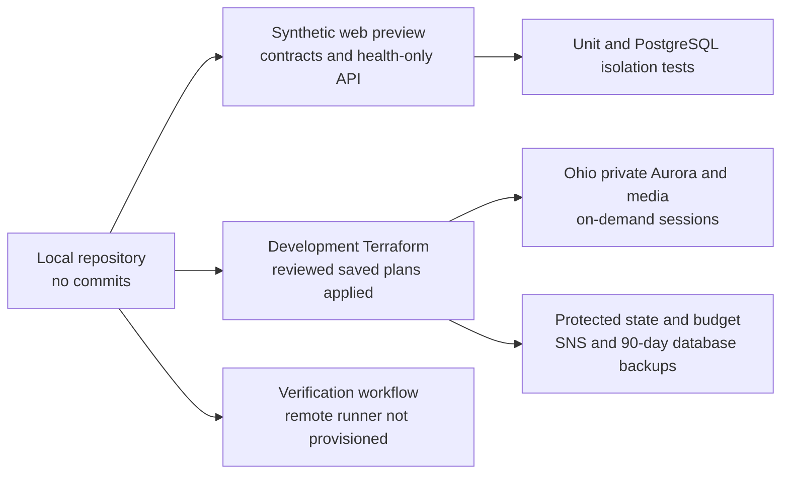
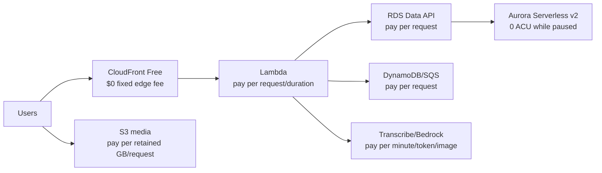

# Cost and scalability design review

Status: greenfield target review

Date: 2026-09-07 (Ohio core-price refresh; other rates retain their dates in the cost model)

Scope: architecture proposed in [DESIGN.md](DESIGN.md) and inventoried in [inventory.yaml](inventory.yaml)

## Executive summary

### Accepted development revision — 2026-09-24

The owner selected standard CloudFront/WAF and weekly snapshots beyond seven days. This supersedes the older Free-plan recommendations below for development. Preserve seven-day native PITR and 12-hour recent snapshots; retain one weekly snapshot for 90 days from creation. At 10 GB, the resulting steady-state database/secret/snapshot/WAF component is about **$9.92/month**, not $42.26. Existing snapshots are not pruned, so savings are gradual. Rates and exclusions are in the cost model's current-decision section.

The development scale-to-zero heuristic remains **8.7/10**: -1.0 for the now-explicitly accepted $6/month WAF baseline and -0.3 for retained data/credentials. Application compute remains zero-minimum; security is not weakened to improve this score. The three largest modeled retained/fixed components are WAF ($6), older snapshots (~$2.52), and database storage ($1). Snapshot bytes scale with database size and count; standard edge usage can exceed free allowances, unlike the abandoned flat-rate bundle.

P0 / implemented and applied: replace the 90-day retention on frequent snapshots with seven days and add a weekly/90-day rule in `infra/modules/foundation/backups.tf`; update tests and live checks. P1: remove Free-only publication checks and preserve WAF/OAC and private origins. The owner's follow-up explicitly authorizes deleting the failed empty `quartermaster-dev-edge-free` stack from both AWS and Terraform, superseding the retained-stack proposal. Only the verified empty stack is in scope; never manually rewrite state or delete application resources. GitHub authorization is AVAILABLE. Public preview release still requires a successful pipeline and HTTPS/origin-denial checks. No real church data is admitted by this revision.

2026-09-08 deployment exception: hosting was partially created but AWS rejected FREE eligibility. Public ingress remains disabled and no paid subscription was approved. The unbundled WAF currently adds about $6/month prorated; the temporary deployed-configuration heuristic is **8.7/10**, deducting one additional point from the target 9.7/10 for this avoidable fixed edge charge. At the illustrative mature 10 GB database size the database/secret/snapshots plus this WAF total about $42.26/month before activity/other services. The cause and non-destructive recovery gates are recorded in `docs/DEPLOYMENT-2026-09-08.md`; remove the additional deduction only after FREE activation is independently verified. The full-target recommendations below are not a claim that public deployment succeeded.

Delivery milestone authorized after the initial foundation: implement GitHub → CodeBuild/CodePipeline and deploy the ready web/API and supporting cloud services. Execute backlog tasks COST-003/004/010 incrementally (the recommendation numbering below predates that backlog), with ephemeral unprivileged PR runners separated from trusted artifact deployment. CodeConnections requires the owner's interactive GitHub authorization; complete safe in-scope implementation while that is pending. `infra/environments/delivery` isolates delivery state; GitHub checks, pipeline builds, and artifact publication have separate scoped roles. Native CloudFormation bridges the pinned provider's missing FREE subscription resource. No production, paid edge-plan substitution, or real-data/AI activation is implied. The delivery cost increment is modeled in cost_model.md; no warm runner, NAT, API Gateway, or provisioned Lambda is added.

The development data/governance foundation is deployed in Ohio; application integrations remain local or unimplemented. This review's 9.7/10 score describes the full target posture, not a fully deployed product. Current implementation and live validation evidence are in `docs/IMPLEMENTATION.md` and `docs/DEPLOYMENT-2026-09-07.md`.

The cost-optimization guardrails influenced the deployed foundation: no warm network/compute fleet, bounded zero-minimum Aurora capacity, explicit snapshot-retention economics, project budget alerts, and reviewed saved plans. CloudWatch observed the actual development writer at 0.0 ACU for consecutive 17:22–17:24 UTC samples on 2026-09-07. The target score is unchanged; storage, backups and credentials remain billable. Cost allocation is still awaiting AWS tag discovery/activation, and full application/restore acceptance is not claimed.

- Illustrative retained database/secret cost: **$1.40/month for development alone** (10 GB plus one secret). The eventual two-account/two-environment idle reference is **$2.80/month** after assumed account allowances, or **$4.95/month gross**, before media, backup copies, additional state/log bytes, shared fees, and activity. These are component estimates, not complete bills; account allowances are not guaranteed.
- Scale-to-zero score: **9.7/10**. Production and development have no continuously billed application compute, network, or edge capacity when idle.
- The two-environment reference retains 20 GB of Aurora storage (**$2.00/month**) plus two database secrets (**$0.80/month**). Q-032 selects separate accounts, with production deferred until church acceptance; alarm allowances still depend on other account usage. Ohio database and secret rates were checked on 2026-09-07; see `cost_model.md` sections 3.1 and 5 for sources and assumptions.
- The 90-day backup decision materially changes retained-data cost: the implemented twice-daily snapshot plan reaches about **$34.86/month** of backup storage at an illustrative constant 10 GB database, or **$36.26/month** including database/one secret before other charges. See cost model §5.3; the earlier $1.40 is only the database/secret component, not a complete idle bill.
- The most important controls are to keep every Aurora instance at zero minimum, keep Lambda out of the VPC through the Data API, reject auto-pause inhibitors in CI, avoid always-on search/cache/container infrastructure, and make cold database activation an explicit UX state.

Top five changes that affect the idle floor or marginal slope:

1. Production and development `min_capacity=0` avoid $43.80/month per continuously warm 0.5 ACU instance; normal wake-up can be around 15 seconds and deep sleep 30 seconds or longer.
2. CloudFront Free in both environments removes the fixed production edge fee while retaining documented WAF/DDoS features; CloudFront/WAF request logs are unavailable, and accounts using AWS Free Tier are ineligible.
3. CI rejects RDS Proxy, logical replication, Global Database, zero-ETL, Babelfish, provisioned Aurora instances, and nonzero minimums because they can prevent or defeat full pause.
4. PostgreSQL full-text/trigram search avoids a separately provisioned search service. Add OpenSearch only after measured query/relevance failure.
5. Per-tenant Transcribe duration and model token/image admission limits prevent the leading variable costs from growing through abuse, retries, or unbounded context.

## 1. Evidence-backed current state

The target architecture diagram is maintained in `DESIGN.md`. Proposed resources in `inventory.yaml` must not be mistaken for deployed inventory: its `implementation_evidence` lists the deployed foundation subset. There is no application-to-database integration yet.

Read-only checks on 2026-09-07 authenticated the `default` development profile in Ohio, confirmed the public GitHub repository, and reached `mac-dev` and `linux-dev` over SSH. These are existing development facilities, not an implemented Quartermaster deployment. The approved regions are Ohio, N. Virginia, and Oregon; Ohio is primary. Q-032 subsequently confirmed that development stays in the existing account and a separate production account is created only if the church accepts the product. The accepted targets are 99.5% uptime, a 60-second cold start, 24-hour regional recovery time (Q-031), and preferably at most 24 hours of data loss with seven days tolerated at disproportionate backup cost.

## 2. Target cost shape

The modeled idle bill includes retained database/media/backup bytes, credentials, and any account-level fees not covered by allowances. Marginal cost is approximately linear in API requests, Data API request units, active database ACU/I/O/storage, voice minutes, model tokens/images, media bytes, logs, and transfer. The architecture has no compute fleet minimum, fixed edge fee, or per-tenant infrastructure step. Twelve-hour native snapshot/copy attempts and evidence copies target a completed recovery point within a day without a running DR database; storage/transfer/request costs and recovery tests are additive in `cost_model.md` section 5.2.

## 3. Residual idle costs and regression risks

| Residual | Inventory/cost entry | Expected monthly | Why it exists | Treatment |
|---|---|---:|---|---|
| Retained relational bytes | `relational_database`; cost model §5 | $2.00 | The durable asset estate is the product | Apply approved lifecycle/retention; deletion is not an optimization |
| Data API database secrets | `relational_database`; cost model §5 | $0.80 | Data API credential integration/rotation | Keep exactly one per environment and rotate it |
| Optional alarms/DNS/state bytes | observability/edge; cost model §5 | up to ~$2.15 gross | Operability, DNS, and deployment state | Published plan/free allowances may offset them; do not remove safeguards to chase a score |
| Recovery snapshots | `backup_recovery_points`; cost model §5.3 | ~$34.86 at steady-state 10 GB dev DB, before regional copies | Three-month historical recovery | 90-day snapshots plus seven-day native PITR; cross-region/media recovery and restore tests remain pending |

The operational blockers are configuration regressions rather than components in the selected design. Policy tests must fail any nonzero Aurora minimum, provisioned instance, RDS Proxy, logical replication, Aurora Global Database, zero-ETL integration, Babelfish configuration, synthetic keepalive, or in-database scheduler dependency. Scheduled business work runs through EventBridge Scheduler; `pg_cron` jobs can be skipped while Aurora is paused.

The proposed AWS design has no NAT gateway, load balancer, public IPv4, RDS Proxy, ElastiCache, provisioned concurrency, OpenSearch, ECS/EKS, provisioned model throughput, or warm cloud CI runner blocker. Decision 0007 defers native builds/signing and the local coordinator; optional browser/device testing remains outside the AWS runtime estimate. Public-PR jobs must never run on persistent local/LAN hosts.

## 4. Scale-to-zero score

Start at 10.0:

| Deduction | Points | Basis |
|---|---:|---|
| Retained relational/snapshot storage and secrets | -0.3 | Required durability and retention; no warm application capacity |
| **Score** | **9.7/10** | Clamped to 0–10 |

A score of 10 would require removing the retained-data/credential floor, which conflicts with the selected database and retention policies. The score measures infrastructure idle posture, not the size of retained data or whether recovery objectives have been achieved. It does not excuse omitting the now-material snapshot-storage cost.

The 9.7 score covers the proposed AWS runtime, not local hardware ownership. Backup copies add retained-data costs but no required warm application capacity; it is not evidence of achieved uptime or measured billing.

## 5. Cost-ramp analysis

### 5.1 Fixed and stepwise dimensions

- Aurora floor changes by $43.80/month for each instance held continuously at 0.5 ACU. The selected minimum is zero in both environments.
- A zero-minimum Serverless v2 reader at failover priority 0 or 1 can pause with the writer, preserving idle compute economics while increasing active compute.
- CloudFront plan steps from Free ($0) to Pro ($15) to Business ($200). The Pro-to-Business step is $185/month; the current plan table lists uptime SLA beginning at Business, so pay-as-you-go must also be compared if contractual SLA matters.
- Cognito direct/social MAU is covered through 10,000 per organization/account allowance, then becomes per-MAU; SAML/OIDC uses a different 50-MAU allowance.
- CloudWatch, Lambda, SQS, DynamoDB, CodeBuild, and CodePipeline allowances can make low usage appear free; unit economics must exclude them for forecasts.
- S3 lifecycle classes introduce minimum object size/duration and retrieval/transition steps.

### 5.2 Potential nonlinear growth

- AI context replay: sending the entire conversation every turn makes input tokens grow quadratically with session length. Maintain a bounded structured state plus rolling/summarized history.
- Retry amplification: one failed media job can multiply S3 reads, model calls, logs, Data API writes, and queue operations. Retry only classified transient errors, with maximum receives and idempotent result keys.
- Query fanout: an unbounded estate report can scan/join large tables and scale Aurora ACUs/I/O sharply. Compile a constrained DSL, enforce statement timeouts/cost limits, and move large reports async.
- Log amplification: verbose prompt/transcript/image metadata and retry stacks can make CloudWatch cost grow faster than successful work. Redact, sample, aggregate, and cap field sizes.
- Tenant hot spots: one import/capture campaign can exhaust shared database/model quotas. Use tenant admission queues and weighted limits.
- Media versions: repeatedly regenerating derivatives or preserving every failed multipart/version can grow S3 faster than assets. Use deterministic derivative keys and lifecycle stale versions/uploads.
- CloudFront plan boundary: request allowance steps should be monitored even though documented allowances are not hard caps.

## 6. Scalability and failure analysis

### 6.1 Stateful coupling and connections

The Data API removes Lambda connection-pool storms and VPC networking, but it has payload/result/transaction constraints and a per-request charge. Paginate under 1 MiB response and 64 KiB row limits, keep transactions short, and benchmark batch operations. Do not introduce RDS Proxy with zero-minimum Aurora because its held connections prevent pause.

Conversation state in DynamoDB prevents long voice sessions from pinning relational transactions. Final commit is a short Aurora transaction using an idempotency key. Active state TTL cleanup and a durable relational commit summary prevent abandoned sessions from becoming permanent operational data.

### 6.2 Singletons and failure domains

- One production writer is the initial cost/recovery compromise. Aurora storage is multi-AZ, but compute recovery is slower without a reader. If availability requires a reader, retain zero minimum and validate co-pause, resume, and failover.
- CloudFront, Cognito, S3, DynamoDB, SQS, Lambda, Transcribe, and Bedrock are managed regional/global services; application quotas and regional dependencies remain failure domains.
- Core and AI APIs have separate functions/concurrency so model throttling cannot consume all core capacity.
- SQS buffers media/rule/export work. The core API does not synchronously fan out to every downstream action.
- A delayed SQS trigger is accepted before a domain transaction commits its deterministic outbox batch ID. The worker later fetches that exact batch, so committed events have a durable wake signal without polling Aurora; triggers for failed commits are harmless no-ops.

### 6.3 Partitions, indexes, and hot keys

- All PostgreSQL tenant-owned indexes begin with `tenant_id` where access patterns require it; explain plans are tested at representative scale.
- Avoid a single global sequence. Use UUIDv7/equivalent IDs.
- DynamoDB session keys distribute by hashed/opaque session ID. Rate counters must shard time buckets if a global key becomes hot.
- S3 opaque object IDs distribute naturally; do not list tenant prefixes as an interactive database.
- Rules batch tenants and cap mutations; imports use job partitions rather than one giant transaction.

### 6.4 Cold starts and wake-up

- Keep API bundles small and use arm64. No provisioned concurrency initially.
- Lambda cold starts should be subdominant to database/model calls and measured separately.
- Both Aurora writers are expected to pause after five idle minutes. A Data API request resumes the writer; after more than 24 hours, deep-sleep activation can take 30 seconds or longer.
- The static shell displays “Starting Quartermaster” while online data requests wait for activation; current-tab input remains in memory on a best-effort basis. Decision 0007 excludes offline data/durable local drafts. Use a 60-second timeout, at most three bounded attempts, and the same idempotency key for a retried mutation; only server acknowledgment means saved.
- Do not perform post-login warm-up requests, synthetic health queries, or keepalive traffic. Only real user or scheduled work should wake the database.

### 6.5 Backpressure and queue lag

- Media Lambda concurrency is bounded below Bedrock/database quotas.
- Scale workers from queue depth/age; batch only when each item remains independently idempotent.
- Visibility timeout exceeds worst normal worker duration and is extended only for live progress.
- DLQ on first message alerts, and replay uses a reviewed tool that preserves attempt history.
- If AI is saturated, accept/uploads drafts and tell the user extraction is delayed. Core capture must not fail merely because AI is unavailable.

### 6.6 Concurrent edits and event order

Online mutations carry operation/idempotency IDs and base versions. The server is authoritative; stale updates require reconciliation without silent overwrite. No client offline queue or dependency-ordered synchronization is required under decision 0007. Server outbox consumers still tolerate duplicates and out-of-order arrival using aggregate versions. Notifications are hints; clients re-read server state while connected.

## 7. Prioritized recommendations

The original recommendations below describe the full target. The current build deploys parts of the foundation; `docs/IMPLEMENTATION.md` records completed work and remaining acceptance gates. Recommendations are not automatically complete merely because a scaffold exists. The user-authorized development deployment added 28 Terraform resources across two stages and reconciled one parameter without deleting or replacing resources.

### P0 — low-risk immediate design protections

#### COST-001: Enforce zero-compute idle infrastructure

- Files/resources: planned `infra/environments/dev`, `infra/environments/prod`, `infra/modules/database`, Lambda/edge settings.
- Change: Aurora `min_capacity=0` with a 300-second auto-pause in both environments, no provisioned concurrency, and CloudFront Free in both environments.
- Rationale: long idle periods should have no continuously billed application compute, network, or edge capacity.
- Impact: avoids about $43.80/month per continuously warm 0.5 ACU database instance and $15/month versus production CloudFront Pro.
- Tradeoffs: first database use waits for activation; Free lacks standard CloudFront/WAF request logs, has lower allowances, and requires an account not using AWS Free Tier.
- Prerequisites/rollback: supported Aurora engine/region and eligible CloudFront account; changing to a paid/warm posture requires a new approved architecture decision, not an operational rollback.
- Codex Action: `produce patch` after the Terraform scaffold exists.

#### COST-002: Add prohibited-always-on policy checks

- Files/resources: planned `infra/policies`, `.github/workflows`, Terraform plans.
- Change: CI fails on NAT gateway, ALB/NLB, public database/IP, OpenSearch, RDS Proxy, provisioned model throughput/concurrency/Aurora, logical replication, Global Database, zero-ETL, Babelfish, or any nonzero database minimum without an approved exception.
- Rationale: prevents a single configuration from adding a large floor or defeating auto-pause.
- Impact: floor protection; no runtime marginal impact.
- Tradeoffs: legitimate SLO changes require a documented exception.
- Prerequisites/rollback: select OPA/Conftest or equivalent; rollback narrows the policy with review rather than disables it.
- Codex Action: `produce patch` during infrastructure foundation.

#### COST-003: Make cost allocation and limits mandatory

- Files/resources: planned Terraform provider/default tags, Bedrock/Transcribe admission middleware, budgets/alarms.
- Change: mandatory `Application`, `Environment`, `Owner`, `CostCenter`, `DataClass`, and `ManagedBy` tags; inventory mappings for untaggable resources; parameterized account/region references; budget/anomaly alerts, tenant/global AI quotas, reserved concurrency, bounded retries.
- Rationale: detects and stops variable-cost abuse before bill reconciliation.
- Impact: lower tail risk and retry slope; negligible fixed cost within initial alarm allowances.
- Tradeoffs: strict limits can temporarily reject legitimate campaigns; provide quota-request flow.
- Prerequisites/rollback: owner thresholds and support process; rollback raises a specific limit, never removes all limits.
- Codex Action: `produce patch` during Phase 0/2.

### P1 — bounded architecture implementation

#### COST-004: Implement CloudFront OAC to private serverless origins

- Files/resources: planned `infra/modules/edge`, S3 bucket policies, Lambda Function URL policies.
- Change: static and API origins accept CloudFront only; route APIs without API Gateway/ALB.
- Rationale: preserves serverless marginal cost and prevents origin bypass of WAF/plan controls.
- Impact: avoids API Gateway request charge and ALB floor; CloudFront has no fixed plan fee initially.
- Tradeoffs: application validates Cognito JWTs; API Gateway features must be built or consciously omitted.
- Prerequisites/rollback: integration tests for forwarded auth/body/query and OAC policies; rollback migration to HTTP API is documented, not a public `NONE` URL.
- Codex Action: `produce patch` with edge/API scaffold.

#### COST-005: Implement Aurora/Data API without VPC Lambda/RDS Proxy

- Files/resources: planned `infra/modules/database`, API database adapter, migrations.
- Change: private Aurora cluster, Data API, one secret/environment, bounded/paginated SQL adapter.
- Rationale: relational capability without NAT, endpoints, proxy, or connection storms; both environments can pause.
- Impact: avoids multiple hourly/minimum network/proxy charges; adds $0.35/M Data API units.
- Tradeoffs: Data API payload/transaction constraints and per-call latency/cost.
- Prerequisites/rollback: selected engine supports Data API and zero ACU; adapter contract allows a later direct connection path. Client and test harness implement the 60-second activation window and idempotent retry contract.
- Codex Action: `produce patch` during Phase 1.

#### COST-006: Bound AI context, retries, and admission

- Files/resources: planned `services/conversation-api`, `services/media-worker`, `packages/domain` AI schemas.
- Change: structured state, rolling history, token/image/output limits, per-error retry policy, usage ledger, circuit breakers.
- Rationale: prevents quadratic context and retry multiplication, the largest variable risks.
- Impact: lowers model/transcription/log marginal slope; exact range depends on session measurements.
- Tradeoffs: aggressive summarization can lose conversational nuance; evaluation must cover it.
- Prerequisites/rollback: model evaluation and observability; rollback selects prior versioned prompt/budget policy.
- Codex Action: `produce patch` during Phase 2.

#### COST-007: Keep search/reporting in PostgreSQL first

- Files/resources: planned `db/migrations`, `services/core-api` query compiler, report job.
- Change: tenant-first FTS/trigram/facet indexes, constrained AST, statement limits, async large exports.
- Rationale: avoids an always-on search/data warehouse floor while meeting initial comprehension needs.
- Impact: lowers idle floor materially relative to separate search; may increase Aurora I/O/ACUs.
- Tradeoffs: relevance and complex analytics have limits; query design/index maintenance required.
- Prerequisites/rollback: representative data/load tests; later outbox-fed search projection if SLO fails.
- Codex Action: `produce patch` during Phase 1.

### P2 — decisions/migrations with material tradeoffs

#### COST-008: Validate cold activation and optional co-pausing reader

- Files/resources: accepted `DESIGN.md` Q-006/Q-031 and remaining Q-022, planned production database variables.
- Change: keep the writer at zero minimum, tune its maximum/timeout from evidence, and add only a tested zero-minimum Serverless v2 reader at failover priority 0 or 1 if RTO requires it.
- Rationale: preserves the selected idle posture while validating the cold-resume and availability experience.
- Impact: no idle compute delta; a reader increases compute while active. A nonzero half-ACU floor would add $43.80/month per instance and requires an explicit product-goal change.
- Tradeoffs: cold wake versus first-use latency; reader active cost versus failover time.
- Prerequisites/rollback: cold/deep-sleep resume and failover tests against the accepted 99.5%/60-second targets, timed restore tests against the accepted 24-hour regional recovery target, and confirmation that every instance reaches zero. A same-region reader is not a regional disaster-recovery substitute.
- Codex Action: `produce migration plan` after pilot measurements.

#### COST-009: Define the CloudFront upgrade threshold

- Files/resources: `DESIGN.md` Q-023, planned edge plan setting.
- Change: keep Free at launch and define measured allowance, standard-access-log, security-feature, or contractual-SLA conditions for comparing Pro, Business, and pay-as-you-go.
- Rationale: paid options add a fixed or variable edge cost and materially different operational features.
- Impact: $0 initial plan fee; Pro would add $15/month.
- Tradeoffs: access logs/SLA/features and predictability.
- Prerequisites/rollback: workload account is not using AWS Free Tier, traffic/feature requirements and current plan terms are verified; plan can be changed with documented timing.
- Codex Action: `produce migration plan` before production launch.

#### COST-010: Lifecycle media and evaluate analytics/search offload

- Files/resources: planned S3 lifecycle, exports, query metrics.
- Change: tier cold originals and add S3/Athena/search projections only when access/query telemetry proves value.
- Rationale: storage savings at scale without premature fixed infrastructure.
- Impact: storage marginal slope reduction; retrieval/transition costs rise.
- Tradeoffs: delayed old-image retrieval, duplicate data, eventual consistency.
- Prerequisites/rollback: retention/RTO policy and access distribution; keep thumbnails warm and restore originals before reversing.
- Codex Action: `produce migration plan` after at least 90 days of telemetry.

## 8. Acceptance gates

- Terraform plan contains none of the prohibited resources unless an approved ADR states SLO/cost/owner.
- Both databases reach zero ACU after five idle minutes in a measured test, and no scheduled keepalive prevents it.
- Warm, ordinary cold, and 24-hour-deep-sleep production resume behavior satisfies the approved SLO with visible progress, no failed first request, and no duplicate mutation.
- Terraform/policy tests reject every documented auto-pause inhibitor and nonzero database minimum.
- Direct S3 and Lambda Function URL origin access is denied; CloudFront paths pass auth and load tests.
- Database adapter passes Data API size/transaction/pagination tests.
- AI cost tests prove a hard upper bound per admitted turn/image/session and no unbounded retry.
- Load tests report actual cost dimensions per 1,000 core requests, AI turns, images, and voice minutes.
- Cost and Usage Report/dashboard maps spend to environment and the product counters reconcile within an agreed tolerance.
- Recovery tests validate a completed, consistent database-and-original-media recovery point preferably within 24 hours; failures or age violations alert, and seven days is never silently substituted as the normal schedule. Budget copy storage/transfer and actual restore drills.
- Public-PR jobs are disposable and have no signing credentials or local-LAN access. Shared mobile/desktop web artifacts carry the reviewed commit and checksums; native artifacts/signing are deferred under decision 0007.
- Terraform validates the expected development account from protected configuration, requires a distinct production account after the church-acceptance gate, and applies required tags without printing sensitive host/account details into the public repository.

## 9. Deployment status

Local source, SQL migration, Terraform, tests, and verification workflow now exist. The SQL migration has run only in isolated test databases. The actual-account bootstrap plan contains five additions, no changes, and no deletions and passes the foundation plan checker; it was not applied. No cloud resource, DNS record, mailbox, signing operation, or remote pipeline was created. Remaining implementation and rollout work is in `codex_plan.json`, `docs/IMPLEMENTATION.md`, and `RUNBOOK_ROLLOUT.md`.

The first implementation validation pass on 2026-09-07 passed 54 application/policy/PostgreSQL tests, six Terraform mock tests, type checks, web/API builds, repository metadata checks, and dependency audit. Additional browser and final consistency checks are recorded in the implementation handoff. `.codex-resume` and Terraform plans/state remain ignored; no Aurora integration or regional restore is claimed.
